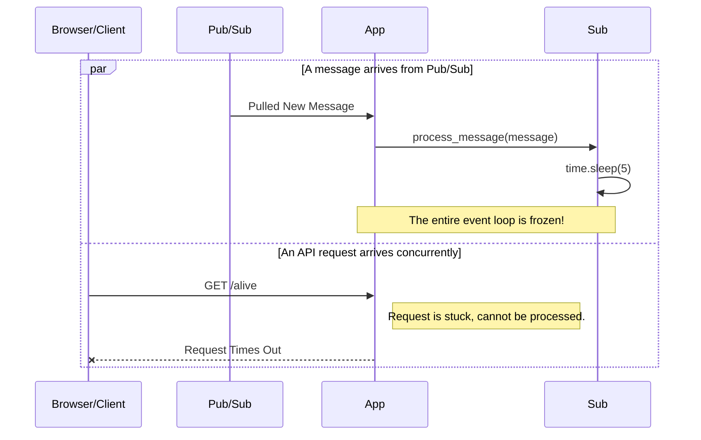
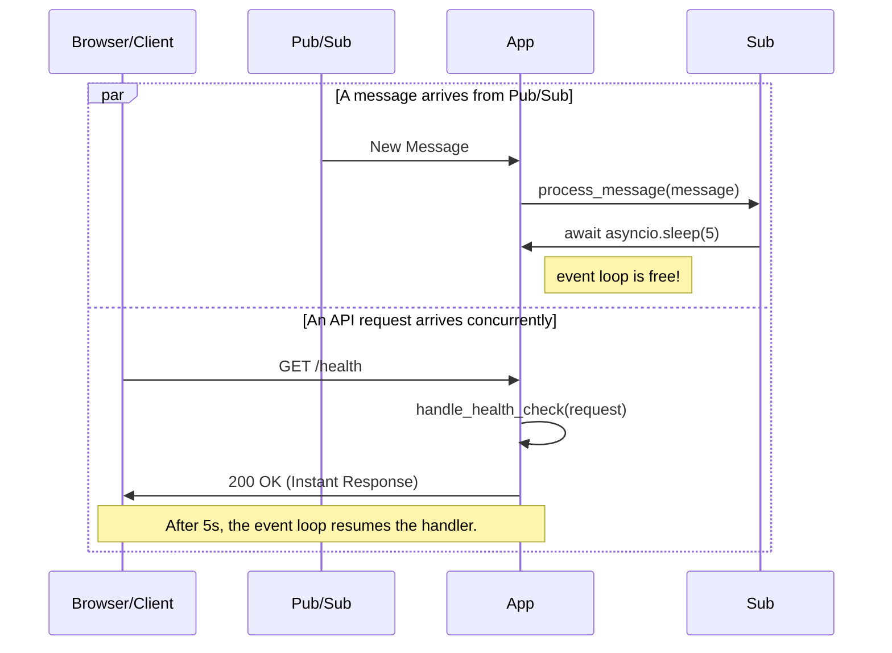

# Subscribing to Topics

A **subscription** is a named resource that represents a stream of messages from a single, specific topic. Your application consumes messages by listening to a subscription. In **FastPubSub**, this is managed elegantly through its *asyncio-native* broker.


## Defining a Subscriber

The primary way to define a subscriber in FastPubSub is with the `@broker.subscriber` decorator. This powerful decorator registers an `async` function as a message handler for a specific topic, automatically managing the connection, message fetching, and acknowledgment lifecycle for you.

Here is the full signature of the decorator:

```python
@broker.subscriber(
    alias: str,
    *,
    topic_name: str,
    subscription_name: str,
    autocreate: bool = True,
    autoupdate: bool = False,
    filter_expression: str = "",
    dead_letter_topic: str = "",
    max_delivery_attempts: int = 5,
    ack_deadline_seconds: int = 60,
    enable_message_ordering: bool = False,
    enable_exactly_once_delivery: bool = False,
    min_backoff_delay_secs: int = 10,
    max_backoff_delay_secs: int = 600,
    max_messages: int = 50,
    middlewares: Sequence[type[BaseMiddleware]] | None = None,
)
```

While the list of options is extensive, you only need to provide the essentials: `alias`, `topic_name`, and `subscription_name`. The rest have sensible defaults based on Google Cloud best practices.

---

## Subscription Configuration Explained

The parameters in the decorator can be grouped into three categories that define how your subscriber behaves.

### 1\. Lifecycle Control

These settings manage the existence of the Pub/Sub resources on Google Cloud when your application starts.

  * `autocreate: bool`: If set to `True`, FastPubSub will automatically create the topic and the subscription on application startup if they don't already exist. This is incredibly useful for development and automated deployments.
  * `autoupdate: bool`: If a subscription already exists, setting this to `True` will update its configuration to match the parameters defined in the decorator. **Note:** This only updates *updatable* fields (see below) and will not create the topic if it's missing.

### 2\. Subscription Behavior (Server-Side)

These settings configure the subscription's behavior directly on Google Cloud. Some of these can only be set upon creation.

  * **Message Filtering:**
      * `filter_expression: str`: Applies a server-side filter so the subscription only receives messages that match the expression. This is far more efficient than filtering messages on the client side (Updatable).
  * **Dead-Lettering:**
      * `dead_letter_topic: str`: Specifies a topic where messages will be sent after they fail processing a certain number of times. This is an essential pattern for preventing "poison pill" messages from blocking your queue (Updatable).
      * `max_delivery_attempts: int`: The number of delivery attempts before a message is sent to the dead-letter topic. This only applies if a `dead_letter_topic` is configured (Updatable).
  * **Delivery Guarantees:**
      * `enable_message_ordering: bool`: Enforces that messages with the same ordering key are processed in the order they were published. This can impact performance and must be set at creation. (Only on Creation)
      * `enable_exactly_once_delivery: bool`: Enables Pub/Sub's exactly-once delivery guarantee, preventing duplicate message processing. This must be set at creation (Only on Creation).
  * **Acknowledgment and Retry Behavior:**
      * `ack_deadline_seconds: int`: The time your handler has to acknowledge (`ack`) a message before Pub/Sub assumes it failed and attempts redelivery (Updatable).
      * `min_backoff_delay_secs: int` and `max_backoff_delay_secs: int`: Configure the exponential backoff delay for retrying messages that are negatively acknowledged (`nack`) (Only on Creation).

### 3\. Handler Behavior (Client-Side)

These settings control how the FastPubSub client processes messages.

  * `middlewares`: A sequence of middlewares to wrap your message handler, allowing you to add cross-cutting concerns like logging, metrics, or custom error handling.
  * `max_messages`: The maximum number of messages the client will process concurrently. This acts as a flow control mechanism to prevent your service from being overwhelmed.

-----

## The Importance of Async

FastPubSub is an *asyncio-native* library, which means your message handlers **must** be `async def` functions.

This design is critical for performance. An `asyncio` application runs on a single thread managed by an event loop. This single thread juggles multiple tasks, such as handling incoming Pub/Sub messages and serving HTTP requests (if using the FastAPI integration). A task can only be paused when it encounters an `await` keyword, allowing the event loop to switch to another task. If you use a blocking operation like `time.sleep()` instead of `await asyncio.sleep()`, you freeze the entire thread. No other tasks can run, causing your application to become unresponsive.

#### Blocking Operation (Don't do this\!)

A blocking call freezes the event loop. Any other tasks, like incoming HTTP requests, will be stalled until the blocking call finishes.



**What is happening here:**

**1.** A message is pulled from Pub/Sub, and the event loop gives control to the Pub/Sub Handler (your function).

**2.** The handler executes `time.sleep(5)`, a blocking call that freezes the entire thread.

**3.** While the handler is blocked, a Client sends a `GET /alive` request to the API.

**4.** The application is completely unresponsive and cannot even begin to process the API request due to event loop being blocked.

**5.** After a long wait, the client's request times out. The application's performance is severely degraded.


#### Non-Blocking Operation (The correct way)

An `await` call yields control back to the event loop, allowing it to work on other tasks while waiting for the operation to complete.



**What is happening here:**

**1.** A message is pulled, and the event loop gives control to the Pub/Sub Handler.

**2.** The handler executes `await asyncio.sleep(5)`. The `await` keyword pauses the handler and yields control back to the event loop.

**3.** While the handler is paused, a Client sends a `GET /alive` request to the API.

**4.** The event loop is free and immediately processes the request, calls the API endpoint, and returns a `200 OK` response to the client. The API remains fast and responsive.

**5.** After the 5-second non-blocking sleep is over, the event loop will resume the handler where it left off.


-----

## Handling Push Subscriptions

While FastPubSub is designed for high-performance **pull-based** consumption, you can easily handle messages from an existing **push** subscription using its FastAPI integration.

A push subscription sends messages via an HTTP POST request to a webhook endpoint. You can create a FastAPI endpoint to receive and process these messages. FastPubSub even provides a Pydantic model, `PushMessage`, to automatically parse the incoming request body.

```python
from fastpubsub import FastPubSub, PubSubBroker, PushMessage
from fastpubsub.logger import logger

broker = PubSubBroker()
app = FastPubSub(broker)

# This endpoint receives messages from a Google Cloud Push Subscription
@app.post("/push-handler/")
async def handle_push_message(data: PushMessage):
    logger.info(f"Received push message: {data.message}")
    # Returning a 2xx status code acknowledges the message to Pub/Sub
    return {"status": "ok"}
```

---

## Recap

In this section, you've learned:

  - How to define a Pub/Sub subscriber declaratively using the `@broker.subscriber` decorator.
  - How to configure a subscription's server-side behavior and client-side handling.
  - Why using non-blocking, `async` code is essential for building responsive applications with FastPubSub.
  - How to receive messages from a push subscription using the FastAPI integration.
