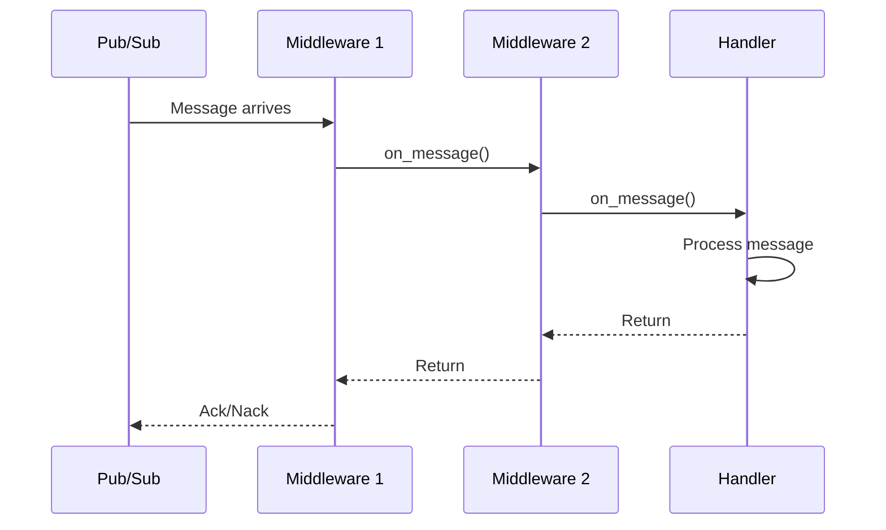

# Custom Middlewares

This guide covers advanced middleware patterns for FastPubSub. For middleware basics, see the [Middlewares](../tutorial/user-guide/middlewares.md) guide in the user tutorial.

## Middleware Lifecycle

Understanding the middleware execution flow helps you write effective middlewares:



!!! info "Execution Order"
    Middlewares execute in registration order for incoming messages (broker → router → subscriber) and reverse order for the return path. For publishing, it's the opposite: subscriber → router → broker middlewares.

## Middleware with Configuration

Create reusable middlewares that accept configuration parameters:

```python
from typing import Any
from fastpubsub import BaseMiddleware, Message, Middleware

class RateLimitMiddleware(BaseMiddleware):
    def __init__(self, next_call: BaseMiddleware, requests_per_second: int = 100):  # (1)!
        super().__init__(next_call)

        self.requests_per_second = requests_per_second
        self.tokens = requests_per_second
        self.last_update = time.monotonic()

    async def on_message(self, message: Message) -> Any:
        await self._acquire_token()
        return await super().on_message(message)

    async def _acquire_token(self):
        # Token bucket implementation
        now = time.monotonic()
        elapsed = now - self.last_update
        self.tokens = min(
            self.requests_per_second,
            self.tokens + elapsed * self.requests_per_second
        )
        self.last_update = now

        if self.tokens < 1:
            await asyncio.sleep(1 / self.requests_per_second)
            self.tokens = 1

        self.tokens -= 1
```

1. Constructor receives configuration parameters

### Applying Configured Middlewares

Use the `Middleware` wrapper to pass configuration:

```python
from fastpubsub import PubSubBroker, Middleware

broker = PubSubBroker(
    project_id="your-project-id",
    middlewares=[
        Middleware(RateLimitMiddleware, requests_per_second=50),  # (1)!
    ]
)
```

1. Pass configuration as keyword arguments

## Subscriber-Only vs Publisher-Only Middlewares

Create middlewares that only affect one direction:

=== "Subscriber Only"
    ```python
    class ValidationMiddleware(BaseMiddleware):
        """Only validates incoming messages."""

        async def on_message(self, message: Message) -> Any:
            # Validate message data
            if not self._is_valid(message.data):
                raise Drop("Invalid message format")
            return await super().on_message(message)

        async def on_publish(
            self, data: bytes, ordering_key: str, attributes: dict[str, str] | None
        ) -> Any:
            # Pass through without modification
            return await super().on_publish(data, ordering_key, attributes)

        def _is_valid(self, data: bytes) -> bool:
            try:
                json.loads(data)
                return True
            except json.JSONDecodeError:
                return False
    ```

=== "Publisher Only"
    ```python
    class CompressionMiddleware(BaseMiddleware):
        """Only compresses outgoing messages."""

        async def on_message(self, message: Message) -> Any:
            # Pass through without modification
            return await super().on_message(message)

        async def on_publish(
            self, data: bytes, ordering_key: str, attributes: dict[str, str] | None
        ) -> Any:
            # Compress data before sending
            compressed = gzip.compress(data)
            if attributes is None:
                attributes = {}
            attributes["content-encoding"] = "gzip"
            return await super().on_publish(compressed, ordering_key, attributes)
    ```

## Error Handling in Middlewares

Handle errors gracefully and decide whether to retry or drop messages:

```python
from fastpubsub import BaseMiddleware, Message
from fastpubsub.exceptions import Drop, Retry

class ErrorHandlingMiddleware(BaseMiddleware):
    async def on_message(self, message: Message) -> Any:
        try:
            return await super().on_message(message)

        except ValidationError as e:
            # Invalid data - don't retry, just drop
            logger.warning(f"Dropping invalid message: {e}")
            raise Drop(f"Validation failed: {e}")

        except TemporaryError as e:
            # Temporary issue - retry later
            logger.info(f"Retrying message due to: {e}")
            raise Retry(f"Temporary failure: {e}")

        except Exception as e:
            # Unexpected error - log and let it propagate
            logger.exception(f"Unexpected error processing message {message.id}")
            raise
```

### Error Transformation

Transform external errors into appropriate FastPubSub exceptions:

```python
class ExternalServiceMiddleware(BaseMiddleware):
    async def on_message(self, message: Message) -> Any:
        try:
            return await super().on_message(message)

        except httpx.ConnectError:
            # Network issue - retry
            raise Retry("External service unreachable")

        except httpx.HTTPStatusError as e:
            if e.response.status_code == 429:
                # Rate limited - retry with backoff
                raise Retry("Rate limited by external service")
            elif e.response.status_code >= 500:
                # Server error - retry
                raise Retry(f"External service error: {e.response.status_code}")
            else:
                # Client error (4xx) - don't retry
                raise Drop(f"Client error: {e.response.status_code}")
```

## Metrics and Observability

Create middlewares for monitoring:

```python
import time
from prometheus_client import Counter, Histogram

# Prometheus metrics
MESSAGES_PROCESSED = Counter(
    "pubsub_messages_processed_total",
    "Total messages processed",
    ["subscriber", "status"]
)
PROCESSING_TIME = Histogram(
    "pubsub_processing_seconds",
    "Message processing time",
    ["subscriber"]
)

class MetricsMiddleware(BaseMiddleware):
    def __init__(self, next_call: BaseMiddleware, subscriber_name: str):
        super().__init__(next_call)

        self.subscriber_name = subscriber_name

    async def on_message(self, message: Message) -> Any:
        start = time.monotonic()
        status = "success"

        try:
            result = await super().on_message(message)
            return result
        except Exception:
            status = "error"
            raise
        finally:
            duration = time.monotonic() - start
            MESSAGES_PROCESSED.labels(
                subscriber=self.subscriber_name,
                status=status
            ).inc()
            PROCESSING_TIME.labels(
                subscriber=self.subscriber_name
            ).observe(duration)
```


### Integration Testing

Test middleware with actual message flow:

```python
import pytest
from fastpubsub import PubSubBroker, Message
from fastpubsub.testing import PubSubTestClient

@pytest.mark.asyncio
async def test_middleware_integration():
    processed_messages = []

    class TrackingMiddleware(BaseMiddleware):
        async def on_message(self, message: Message):
            processed_messages.append(message.id)
            return await super().on_message(message)

    broker = PubSubBroker(project_id="test")
    broker.include_middleware(TrackingMiddleware)

    @broker.subscriber(
        alias="test-handler",
        topic_name="test-topic",
        subscription_name="test-subscription",
    )
    async def handle(message: Message):
        pass

    async with PubSubTestClient(broker) as client:
        await client.publish({"data": "test"}, topic="test-topic")

    assert len(processed_messages) == 1
```

??? example "See middleware examples"
    Check out complete middleware examples in [snippets/middlewares/](../../snippets/middlewares/).

## Middleware Composition

Combine multiple simple middlewares instead of one complex middleware:

```python
# Instead of one big middleware
class DoEverythingMiddleware(BaseMiddleware):
    # Logging + Metrics + Validation + Error Handling
    pass

# Use composition
broker = PubSubBroker(
    project_id="your-project-id",
    middlewares=[
        Middleware(LoggingMiddleware),
        Middleware(MetricsMiddleware, subscriber_name="orders"),
        Middleware(ValidationMiddleware),
        Middleware(ErrorHandlingMiddleware),
    ]
)
```

!!! tip "Single Responsibility"
    Each middleware should do one thing well. This makes them easier to test, reuse, and reason about.

## Best Practices

1. **Always Call Super**: Every middleware must call `await super().on_message()` or `await super().on_publish()` to continue the chain. Forgetting this breaks the middleware chain.

2. **Keep Middlewares Fast**: Middlewares run on every message. Heavy operations slow down all message processing. Offload slow work to background tasks.

3. **Handle Exceptions Carefully**: Unhandled exceptions in middlewares propagate up and cause message nacks. Decide explicitly whether to retry, drop, or re-raise.

4. **Test in Isolation**: Write unit tests for middlewares independent of the message broker. This catches bugs early and makes debugging easier.

5. **Log Context**: Include message IDs and relevant context in logs. This helps trace issues across the middleware chain.

## Recap

- **Middleware lifecycle** follows registration order in, reverse order out
- **Configured middlewares** use `Middleware` wrapper to pass parameters
- **Subscriber/publisher-only** middlewares implement only the relevant method
- **Resource management** uses `on_startup` and `on_shutdown` hooks
- **Error handling** transforms exceptions into `Drop` or `Retry`
- **Testing** can be done in isolation or with `PubSubTestClient`
- **Composition** keeps middlewares simple and reusable
