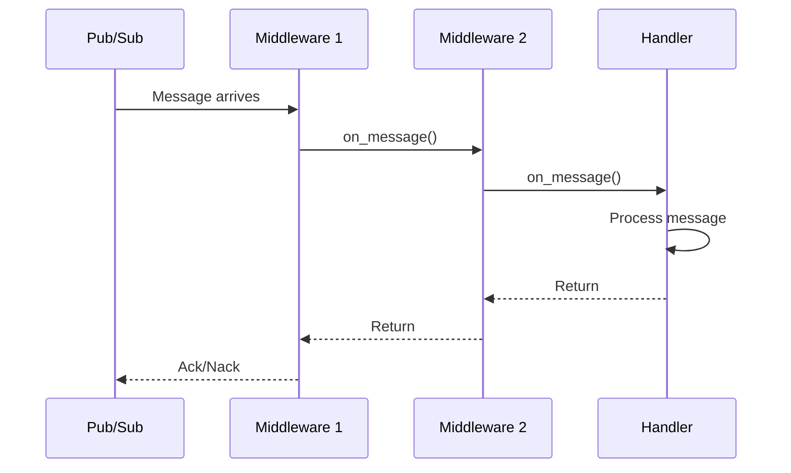

# Custom Middlewares

This guide covers advanced middleware patterns for FastPubSub. For middleware basics, see the [Middlewares](../tutorial/user-guide/middlewares.md) guide in the user tutorial.

## Middleware Lifecycle

Understanding the middleware execution flow helps you write effective middlewares:



!!! info "Execution Order"
    Middlewares execute in registration order for incoming messages (broker → router → subscriber) and reverse order for the return path. For publishing, it's the opposite: publisher → router → broker middlewares.

## Middleware with Configuration

Create reusable middlewares that accept configuration parameters:

```python
--8<-- "advanced/e1_01_custom_middlewares.py:rate_limit_middleware"
```

1. Constructor receives configuration parameters

### Applying Configured Middlewares

Use the `Middleware` wrapper to pass configuration:

```python
from fastpubsub import PubSubBroker, Middleware

broker = PubSubBroker(
    project_id="your-project-id",
    middlewares=[
        Middleware(RateLimitMiddleware, requests_per_second=50),  # (1)!
    ]
)
```

1. Pass configuration as keyword arguments

---

## Step-by-Step

1. Create a middleware class and implement `on_message` or `on_publish`.
2. Add configuration via the `Middleware(...)` wrapper if needed.
3. Register it at the broker, router, or subscriber level.
4. Test behavior using `PubSubTestClient`.

## Subscriber-Only vs Publisher-Only Middlewares

Create middlewares that only affect one direction:

=== "Subscriber Only"
    ```python
    --8<-- "advanced/e1_01_custom_middlewares.py:validation_middleware"
    ```

=== "Publisher Only"
    ```python
    --8<-- "advanced/e1_01_custom_middlewares.py:compression_middleware"
    ```

## Error Handling in Middlewares

Handle errors gracefully and decide whether to retry or drop messages:

```python
--8<-- "advanced/e1_01_custom_middlewares.py:error_handling_middleware"
```

### Error Transformation

Transform external errors into appropriate FastPubSub exceptions:

```python
class ExternalServiceMiddleware(BaseMiddleware):
    async def on_message(self, message: Message) -> Any:
        try:
            return await super().on_message(message)

        except httpx.ConnectError:
            # Network issue - retry
            raise Retry("External service unreachable")

        except httpx.HTTPStatusError as e:
            if e.response.status_code == 429:
                # Rate limited - retry with backoff
                raise Retry("Rate limited by external service")
            elif e.response.status_code >= 500:
                # Server error - retry
                raise Retry(f"External service error: {e.response.status_code}")
            else:
                # Client error (4xx) - don't retry
                raise Drop(f"Client error: {e.response.status_code}")
```

## Metrics and Observability

Create middlewares for monitoring:

```python
--8<-- "advanced/e1_01_custom_middlewares.py:metrics_middleware"
```


### Integration Testing

Test middleware with actual message flow:

```python
import pytest
from fastpubsub import PubSubBroker, Message
from fastpubsub.testing import PubSubTestClient

@pytest.mark.asyncio
async def test_middleware_integration():
    processed_messages = []

    class TrackingMiddleware(BaseMiddleware):
        async def on_message(self, message: Message):
            processed_messages.append(message.id)
            return await super().on_message(message)

    broker = PubSubBroker(project_id="test")
    broker.include_middleware(TrackingMiddleware)

    @broker.subscriber(
        alias="test-handler",
        topic_name="test-topic",
        subscription_name="test-subscription",
    )
    async def handle(message: Message):
        pass

    async with PubSubTestClient(broker) as client:
        await client.publish({"data": "test"}, topic="test-topic")

    assert len(processed_messages) == 1
```

??? example "See middleware examples"
    Check out complete middleware examples in [snippets/middlewares/](../../snippets/middlewares/).

## Middleware Composition

Combine multiple simple middlewares instead of one complex middleware:

```python
--8<-- "advanced/e1_01_custom_middlewares.py:middleware_composition"
```

!!! tip "Single Responsibility"
    Each middleware should do one thing well. This makes them easier to test, reuse, and reason about.

---

## Common Pitfalls

- Forgetting to call `super()` in `on_message` or `on_publish`.
- Doing slow I/O in middleware without `await`.
- Mixing FastAPI middlewares with FastPubSub middlewares.

## Best Practices

1. **Always Call Super**: Every middleware must call `await super().on_message()` or `await super().on_publish()` to continue the chain. Forgetting this breaks the middleware chain.

2. **Keep Middlewares Fast**: Middlewares run on every message. Heavy operations slow down all message processing. Offload slow work to background tasks.

3. **Handle Exceptions Carefully**: Unhandled exceptions in middlewares propagate up and cause message nacks. Decide explicitly whether to retry, drop, or re-raise.

4. **Test in Isolation**: Write unit tests for middlewares independent of the message broker. This catches bugs early and makes debugging easier.

5. **Log Context**: Include message IDs and relevant context in logs. This helps trace issues across the middleware chain.

## Recap

- **Middleware lifecycle** follows registration order in, reverse order out
- **Configured middlewares** use `Middleware` wrapper to pass parameters
- **Subscriber/publisher-only** middlewares implement only the relevant method
- **Resource management** uses `on_startup` and `on_shutdown` hooks
- **Error handling** transforms exceptions into `Drop` or `Retry`
- **Testing** can be done in isolation or with `PubSubTestClient`
- **Composition** keeps middlewares simple and reusable
