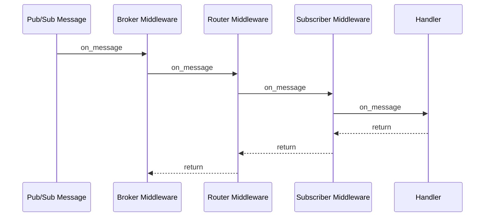

# Custom Middlewares

FastPubSub middlewares provide explicit interception points for cross-cutting concerns such as validation,
rate control, telemetry, and lifecycle error mapping.

This page focuses on designing production-grade custom middlewares and composing them safely.
For baseline usage, see [Middlewares](../tutorial/user-guide/middlewares.md).

## Execution Topology

Middleware execution order follows registration hierarchy.



For publish flow, direction is inverted (publisher -> router -> broker).

## Why Use Custom Middlewares

Custom middlewares are best when logic must be:

- Applied consistently across many subscribers or publishers.
- Independent from domain-specific business handlers.
- Reusable and testable as an isolated unit.

Typical examples include:

- Structured validation gates.
- Rate limiting and admission control.
- Metadata enrichment and contract tagging.
- Latency and status telemetry.

## Configured Middleware (Stateless-First)

A configured middleware instance is often preferable to hard-coded constants.

```python
--8<-- "advanced/e1_01_custom_middlewares.py:rate_limit_middleware"
```

Register configured middleware using the `Middleware(...)` wrapper:

```python
--8<-- "advanced/e1_01_custom_middlewares.py:configured_middleware_registration"
```

The wrapper keeps constructor arguments explicit while preserving declarative broker setup.

!!! warning "Prefer Stateless Middlewares"
    Middlewares should be stateless whenever possible.
    If state is required (for example, rate limiting counters, distributed locks, dedup keys), store it in dedicated
    external systems such as Redis or a persistence service. Do not keep mutable operational state inside middleware instances.

## Directional Middlewares

Some middlewares should affect only one direction.

### Subscriber-Side Validation

```python
--8<-- "advanced/e1_01_custom_middlewares.py:validation_middleware"
```

### Publisher-Side Metadata Enrichment

```python
--8<-- "advanced/e1_01_custom_middlewares.py:publisher_metadata_middleware"
```

!!! note "Use Built-In Compression Middleware"
    For payload compression, prefer the built-in `GZipMiddleware`.
    Custom middlewares should demonstrate behavior not already covered by the framework core.

## Error Classification Strategy

Middleware is an appropriate location to convert broad exceptions into explicit message lifecycle intent (`Drop` vs `Retry`).

```python
--8<-- "advanced/e1_01_custom_middlewares.py:error_handling_middleware"
```

This keeps domain handlers focused on business behavior while centralizing policy for transient and permanent errors.

## Observability Middleware Pattern

```python
--8<-- "advanced/e1_01_custom_middlewares.py:metrics_middleware"
```

Even simple latency/status logging at middleware level can significantly reduce mean-time-to-diagnosis during incident response.

## Composition Strategy

Prefer multiple single-responsibility middlewares over one monolithic middleware.

```python
--8<-- "advanced/e1_01_custom_middlewares.py:middleware_composition"
```

Suggested order for inbound message handling:

1. **Admission/validation** first.
2. **Policy mapping** (error handling) next.
3. **Metrics/logging** around the call boundary.

## Anti-Pattern: Cross-Middleware Dependencies

Avoid designing middleware A to depend on side effects from middleware B.
Middleware chains should remain composable and order-tolerant.

Instead of hidden dependencies between middlewares:

- Place shared state in a dedicated service (cache, database, message store).
- Inject that service into each middleware through `Middleware(...)` arguments.
- Keep each middleware independently testable and replaceable.

## Validation with `PubSubTestClient`

Use `PubSubTestClient` to assert middleware outcomes directly in tests.

```python
--8<-- "advanced/e1_01_custom_middlewares.py:middleware_integration_test"
```

This approach validates middleware chain behavior without emulator dependency.

## Design Rules for Reliable Middleware

### Always Continue the Chain

Call `await super().on_message(...)` or `await super().on_publish(...)` unless the middleware intentionally terminates flow.

### Keep Middleware Fast

Middlewares execute on every message. Avoid blocking operations and unbounded in-memory state.

### Preserve Determinism

Any non-deterministic behavior (random waits, external side effects without safeguards) increases debugging complexity.

### Emit Actionable Context

Logs and metrics should include stable identifiers (`message_id`, subscriber alias, error class) to support cross-system correlation.

## Common Failure Modes

- Omitting `super()` and breaking the chain.
- Mixing unrelated concerns into one middleware class.
- Keeping mutable runtime state inside middleware instances.
- Creating hidden dependencies between middleware classes.
- Raising generic exceptions instead of `Drop`/`Retry` when policy is known.

## Recap

- Custom middlewares are the primary extension point for cross-cutting runtime policy.
- Use `Middleware(...)` for configured, reusable classes.
- Keep middlewares stateless and externalize mutable state when needed.
- Separate subscriber and publisher concerns when behavior differs by direction.
- Avoid middleware-to-middleware dependencies; share state through explicit services.
- Compose small middlewares in explicit order.
- Validate middleware behavior with `PubSubTestClient` before production rollout.
