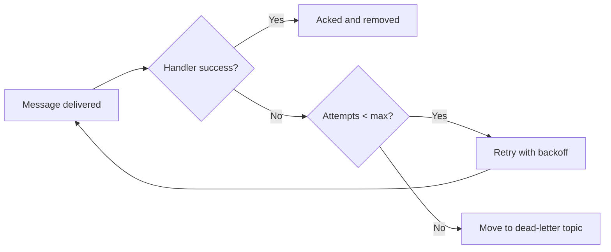

# Dead-Letter Topics

Dead-letter topics (DLT) provide bounded failure handling for subscriptions that cannot process some messages successfully.
Instead of retrying indefinitely, Pub/Sub redirects repeatedly failing messages to a separate topic after a configured number
of delivery attempts.

In production systems, this mechanism protects healthy traffic from poison messages and creates an explicit queue for
operational triage.

## Conceptual Model

A message follows this lifecycle:

1. It is delivered to a subscription.
2. The handler succeeds and acknowledges the message, or fails and triggers a retry.
3. Retry continues until `max_delivery_attempts` is reached.
4. Pub/Sub moves the message to `dead_letter_topic`.

This means dead-letter routing is not a replacement for handler quality.
It is a containment mechanism that prevents one pathological message class from degrading the full subscription.



## Baseline Configuration

Configure dead-letter routing directly in the subscriber declaration:

```python
--8<-- "advanced/e1_02_dlt.py:basic_dlt_config"
```

### Parameters and Their Roles

| Parameter | Role | Typical Decision Rule |
|----------|------|-----------------------|
| `dead_letter_topic` | Destination for failed messages | Use `{topic}-dlq` or `{topic}-dlt` naming convention. |
| `max_delivery_attempts` | Retry ceiling before reroute | Start with `5` (the minimum), increase only if transient failures are common. |
| `autocreate` | Creates resources at startup | Keep `True` in local or dev environment but decide by platform policy in prod. |

## Retry Dynamics and Backoff

Dead-letter topics are most effective when paired with deliberate retry pacing.

```python
--8<-- "advanced/e1_02_dlt.py:backoff_config"
```

With exponential backoff, transient outages receive time to recover while permanent failures are eventually quarantined.

| Attempt | Approximate Wait |
|---------|------------------|
| 1 | Immediate |
| 2 | ~10 seconds |
| 3 | ~20 seconds |
| 4 | ~40 seconds |
| 5 | ~80 seconds |
| 6+ | 600 seconds as maximum back-off period |

## Handling Dead-Letter Traffic

A dead-letter topic should always have a dedicated consumer path.
If not, failures become invisible operational debt.

```python
--8<-- "advanced/e1_02_dlt.py:dlq_handler"
```

The handler should implement at least one of the following:

- **Alerting** for immediate operator awareness.
- **Persistence** for forensic analysis and replay workflows.
- **Enrichment** with diagnostic context (correlation IDs, tenant, source service).

## Operational Patterns

### Alert + Persist Pattern

```python
--8<-- "advanced/e1_02_dlt.py:dlq_pattern_alert_store"
```

### Fallback Execution Pattern

```python
--8<-- "advanced/e1_02_dlt.py:dlq_pattern_retry"
```

### Manual Review Queue Pattern

```python
--8<-- "advanced/e1_02_dlt.py:dlq_pattern_review"
```

## Validation with `PubSubTestClient`

`PubSubTestClient` is useful to verify local failure behavior (for example, that handler failures are observable in test results)
without infrastructure dependency.

```python
--8<-- "advanced/e1_02_dlt.py:dlt_test_client"
```

Note that in-memory tests validate application behavior and error surfaces.
Final validation of managed dead-letter routing itself should still be exercised in an integration environment.

## Design Recommendations

### Choosing `max_delivery_attempts`

- Keep values low when failures are deterministic (schema errors, impossible states).
- Increase values when downstream dependencies are known to recover quickly.
- Prefer explicit tuning over high defaults; large values delay incident visibility.

### Naming Strategy

Use a consistent suffix and include bounded domain context:

- `orders-dlq`
- `payments-dlq`
- `inventory-dlq`

Consistent names simplify dashboards, alerts, and runbook lookup.

### Monitoring Signals

Track:

- Dead-letter message ingress rate.
- Most frequent failure class.
- Time-to-resolution per dead-letter message.
- Replay success rate after remediation.

## Common Failure Modes

- Configuring a dead-letter topic but never subscribing to it.
- Setting `max_delivery_attempts` too high and delaying diagnosis.
- Ignoring retry backoff, causing rapid failure loops.
- Mixing naming conventions and losing traceability.

## Recap

- Dead-letter topics isolate persistent failures from healthy traffic.
- Configure `dead_letter_topic` and `max_delivery_attempts` per subscriber.
- Pair dead-letter routing with retry backoff for controlled failure pacing.
- Always consume and monitor the dead-letter topic.
- Validate handler failure behavior early with `PubSubTestClient`, then verify managed routing in integration.
