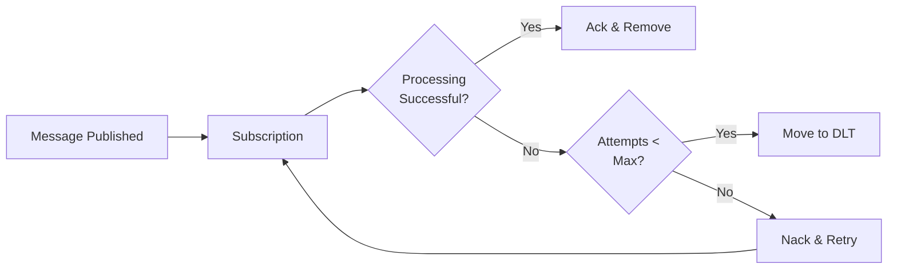

# Dead-Letter Topics

Dead-letter topics (DLT) catch messages that fail processing after multiple attempts. They prevent problematic messages from blocking your queue and give you a chance to investigate and fix issues.

## Why Use Dead-Letter Topics?

Sometimes messages fail repeatedly. Maybe the data is malformed, a required service is down, or there's a bug in your code. Without dead-letter topics, these "poison pill" messages keep retrying forever, consuming resources and blocking other messages.

!!! info "What is a Poison Pill?"
    A poison pill is a message that causes your handler to fail every time it tries to process it. Common causes include invalid JSON, missing required fields, or data that triggers edge-case bugs.

## How Dead-Letter Topics Work

When a message fails processing, Pub/Sub tracks the delivery attempt count. After reaching the maximum attempts, the message moves to a dead-letter topic instead of being retried again.



## Basic Configuration

Configure a dead-letter topic by adding three parameters to your subscriber:

```python
from fastpubsub import FastPubSub, PubSubBroker, Message

broker = PubSubBroker(project_id="your-project-id")  # (1)!
app = FastPubSub(broker)

@broker.subscriber(
    alias="order-processor",
    topic_name="orders",
    subscription_name="orders-subscription",
    dead_letter_topic="orders-dlq",  # (2)!
    max_delivery_attempts=5,  # (3)!
    autocreate=True,  # (4)!
)
async def process_order(message: Message):
    await process_payment(message.data)
```

1. Your GCP project ID
2. Topic where failed messages go (DLQ = Dead Letter Queue)
3. How many times to retry before moving to DLT
4. Automatically creates the dead-letter topic if it doesn't exist

!!! tip "Choosing max_delivery_attempts"
    Start with 5 attempts (the minimum). This gives transient failures (network issues, service restarts) time to resolve while catching persistent problems quickly.

## Configuring Retry Backoff

Control how long Pub/Sub waits between retry attempts using backoff settings:

```python
@broker.subscriber(
    alias="api-caller",
    topic_name="api-requests",
    subscription_name="api-requests-subscription",
    dead_letter_topic="api-requests-dlq",
    max_delivery_attempts=10,
    min_backoff_delay_secs=10,  # (1)!
    max_backoff_delay_secs=600,  # (2)!
    autocreate=True,
)
async def call_external_api(message: Message):
    await external_api.call(message.data)
```

1. First retry waits 10 seconds
2. Maximum wait between retries caps at 10 minutes

The backoff follows an exponential pattern:

| Attempt | Approximate Wait |
|---------|------------------|
| 1 | Immediate |
| 2 | ~10 seconds |
| 3 | ~20 seconds |
| 4 | ~40 seconds |
| 5 | ~80 seconds |
| 6+ | ~600 seconds (capped) |

## Handling Dead-Letter Messages

Create a subscriber for your dead-letter topic to log, alert, or store failed messages:

```python
import logging

logger = logging.getLogger(__name__)

@broker.subscriber(
    alias="dlq-handler",
    topic_name="orders-dlq",  # (1)!
    subscription_name="orders-dlq-subscription",
    autocreate=True,
)
async def handle_failed_orders(message: Message):
    # Log the failure with details
    logger.error(
        f"Message {message.id} failed permanently",
        extra={
            "message_data": message.data.decode("utf-8"),
            "attributes": message.attributes,
            "delivery_attempt": message.delivery_attempt,
        },
    )

    # Alert your operations team
    await send_alert_to_ops_team(message)

    # Store for later analysis
    await store_failed_message(message)
```

1. Subscribe to the same topic specified in `dead_letter_topic`

!!! warning "Always Handle Your Dead-Letter Topics"
    Don't just configure a DLT and forget about it. Unprocessed dead-letter messages indicate problems that need investigation. Set up alerts when messages arrive in your DLT.

## Common Patterns

=== "Alert and Store"
    ```python
    @broker.subscriber(
        alias="dlq-alert-store",
        topic_name="orders-dlq",
        subscription_name="orders-dlq-subscription",
    )
    async def handle_dlq(message: Message):
        await slack_webhook.send(f"Failed message: {message.id}")
        await database.insert("failed_messages", {
            "message_id": message.id,
            "data": message.data,
            "failed_at": datetime.utcnow(),
        })
    ```

=== "Retry to Different Service"
    ```python
    @broker.subscriber(
        alias="dlq-retry",
        topic_name="payments-dlq",
        subscription_name="payments-dlq-subscription",
    )
    async def retry_with_fallback(message: Message):
        # Try a fallback payment processor
        await fallback_payment_service.process(message.data)
    ```

=== "Manual Review Queue"
    ```python
    @broker.subscriber(
        alias="dlq-review",
        topic_name="orders-dlq",
        subscription_name="orders-dlq-subscription",
    )
    async def queue_for_review(message: Message):
        await admin_dashboard.create_ticket(
            title=f"Failed order: {message.id}",
            data=message.data,
            priority="high",
        )
    ```

## Best Practices

1. **Naming Convention**: Name your dead-letter topics consistently. A common pattern is `{original-topic}-dlq` (e.g., `orders-dlq`, `payments-dlq`).

2. **Monitor DLT Message Count**: Set up monitoring to alert when dead-letter topic message counts increase. A sudden spike often indicates a systemic issue.

3. **Include Context in Messages**: When publishing messages, include attributes like `correlation_id` or `source_service`. This context helps debug failures in your DLT handler.

## Recap

- **Dead-letter topics** catch messages that fail after `max_delivery_attempts` retries
- **Backoff settings** control wait time between retries (`min_backoff_delay_secs`, `max_backoff_delay_secs`)
- **Always create a DLT handler** to log, alert, or store failed messages
- **Monitor your DLTs** - messages there indicate problems needing attention
- **Next**: Learn about [Message Filtering](filters.md) to route messages efficiently
