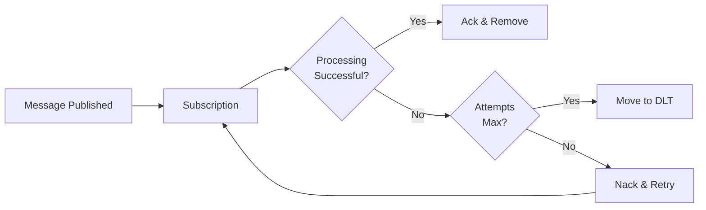

# Dead-Letter Topics

Dead-letter topics (DLT) catch messages that fail processing after multiple attempts. They prevent problematic messages from blocking your queue and give you a chance to investigate and fix issues.

## Why Use Dead-Letter Topics?

Sometimes messages fail repeatedly. Maybe the data is malformed, a required service is down, or there's a bug in your code. Without dead-letter topics, these "poison pill" messages keep retrying forever, consuming resources and blocking other messages.

!!! info "What is a Poison Pill?"
    A poison pill is a message that causes your handler to fail every time it tries to process it. Common causes include invalid JSON, missing required fields, or data that triggers edge-case bugs.

## How Dead-Letter Topics Work

When a message fails processing, Pub/Sub tracks the delivery attempt count. After reaching the maximum attempts, the message moves to a dead-letter topic instead of being retried again.



## Basic Configuration

Configure a dead-letter topic by adding three parameters to your subscriber:

```python
--8<-- "advanced/e1_02_dlt.py:basic_dlt_config"
```

1. Your GCP project ID
2. Topic where failed messages go (DLT = Dead Letter Topic)
3. How many times to retry before moving to DLT
4. Automatically creates the dead-letter topic if it doesn't exist

!!! tip "Choosing max_delivery_attempts"
    Start with 5 attempts (the minimum). This gives transient failures (network issues, service restarts) time to resolve while catching persistent problems quickly.

---

## Step-by-Step

1. Choose a dead-letter topic name (e.g., `orders-dlt`).
2. Set `dead_letter_topic` and `max_delivery_attempts` on the subscriber.
3. Create a handler for the dead-letter topic.
4. Monitor the dead-letter topic for spikes.

## Configuring Retry Backoff

Control how long Pub/Sub waits between retry attempts using backoff settings:

```python
--8<-- "advanced/e1_02_dlt.py:backoff_config"
```

1. First retry waits 10 seconds
2. Maximum wait between retries caps at 10 minutes

The backoff follows an exponential pattern:

| Attempt | Approximate Wait |
|---------|------------------|
| 1 | Immediate |
| 2 | ~10 seconds |
| 3 | ~20 seconds |
| 4 | ~40 seconds |
| 5 | ~80 seconds |
| 6+ | ~600 seconds (capped) |

## Handling Dead-Letter Messages

Create a subscriber for your dead-letter topic to log, alert, or store failed messages:

```python
--8<-- "advanced/e1_02_dlt.py:dlq_handler"
```

1. Subscribe to the same topic specified in `dead_letter_topic`

!!! warning "Always Handle Your Dead-Letter Topics"
    Don't just configure a DLT and forget about it. Unprocessed dead-letter messages indicate problems that need investigation. Set up alerts when messages arrive in your DLT.

---

## Common Pitfalls

- Not creating a handler for the dead-letter topic.
- Setting `max_delivery_attempts` too high (slow feedback).
- Using different naming conventions across services.

## Common Patterns

=== "Alert and Store"
    ```python
    --8<-- "advanced/e1_02_dlt.py:dlq_pattern_alert_store"
    ```

=== "Retry to Different Service"
    ```python
    --8<-- "advanced/e1_02_dlt.py:dlq_pattern_retry"
    ```

=== "Manual Review Queue"
    ```python
    --8<-- "advanced/e1_02_dlt.py:dlq_pattern_review"
    ```

## Best Practices

1. **Naming Convention**: Name your dead-letter topics consistently. A common pattern is `{original-topic}-dlt` (e.g., `orders-dlt`, `payments-dlt`).

2. **Monitor DLT Message Count**: Set up monitoring to alert when dead-letter topic message counts increase. A sudden spike often indicates a systemic issue.

3. **Include Context in Messages**: When publishing messages, include attributes like `correlation_id` or `source_service`. This context helps debug failures in your DLT handler.

## Recap

- **Dead-letter topics** catch messages that fail after `max_delivery_attempts` retries
- **Backoff settings** control wait time between retries (`min_backoff_delay_secs`, `max_backoff_delay_secs`)
- **Always create a DLT handler** to log, alert, or store failed messages
- **Monitor your DLTs** - messages there indicate problems needing attention
- **Next**: Learn about [Message Filtering](filters.md) to route messages efficiently
