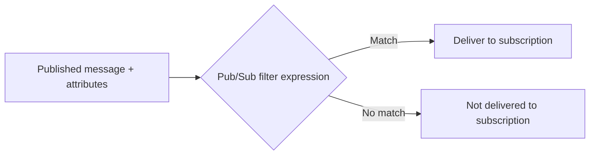

# Message Filtering

Server-side filtering allows Pub/Sub to deliver only messages that match declarative attribute expressions.
For high-volume topics, this is one of the most effective controls for reducing unnecessary subscriber load.

FastPubSub maps this behavior through the subscriber parameter `filter_expression`.

## Conceptual Model

Filtering is evaluated by Pub/Sub before message delivery to your application process.
This has two direct effects:

- Lower application-side compute, because unmatched messages are never pulled.
- Clearer subscriber intent, because routing logic is encoded in subscription configuration.



## Baseline Configuration

```python
--8<-- "advanced/e1_03_filters.py:basic_filter"
```

The expression syntax follows Pub/Sub filter rules and is applied per subscription.

## Attribute Discipline

Filtering only works if publishers consistently provide attributes.

```python
--8<-- "basic_usage/e2_05_publish_with_attributes.py:publish_attributes_broker"
```

### Engineering Implication

Define and version an attribute contract in the same way you define payload schemas.
Inconsistent attribute naming is a common source of silent routing failures.

## Expression Patterns

### Boolean Conjunction (`AND`)

```python
--8<-- "advanced/e1_03_filters.py:filter_and"
```

### Boolean Disjunction (`OR`)

```python
--8<-- "advanced/e1_03_filters.py:filter_or"
```

### Attribute Presence

```python
--8<-- "advanced/e1_03_filters.py:filter_has_prefix"
```

## Multi-Subscriber Fan-Out by Filter

A standard architecture is one topic with multiple subscriptions, each owning a filter.

```python
--8<-- "advanced/e1_03_filters.py:multiple_subscribers"
```

This pattern keeps publisher logic simple while allowing independent consumer pipelines.

## Comparison Semantics

| Operator | Meaning | Example |
|----------|---------|---------|
| `=` | Equality | `attributes.type = "order"` |
| `!=` | Inequality | `attributes.status != "cancelled"` |
| `>` | Lexicographic greater than | `attributes.priority > "5"` |
| `<` | Lexicographic less than | `attributes.priority < "5"` |
| `>=` | Lexicographic greater/equal | `attributes.level >= "warn"` |
| `<=` | Lexicographic less/equal | `attributes.level <= "warn"` |

!!! warning "Attribute Values Are Strings"
    Pub/Sub attributes are string-valued.
    Numeric-looking expressions are still string comparisons unless you normalize values (for example, left-pad numeric strings).

## Validation with `PubSubTestClient`

Filter behavior can be validated in tests by asserting which handlers produced results.

```python
--8<-- "testing/e1_03_filter_expressions.py:test"
```

Reference application fixture:

```python
--8<-- "testing/e1_03_filter_expressions.py:app"
```

## Design Recommendations

### Use Stable Attribute Names

Maintain a small shared vocabulary (for example, `event_type`, `source`, `tenant_id`, `priority`).
Avoid synonyms for the same business concept.

### Keep Expressions Readable

If a filter becomes difficult to reason about, split responsibilities into separate subscriptions.
Operationally, two clear filters are preferable to one opaque filter.

### Include an Audit Stream When Needed

For compliance or incident analysis, maintain one unfiltered subscriber that captures all traffic for archival.
Do this only when volume and retention cost are acceptable.

## Common Failure Modes

- Publishing payload-only messages without required attributes.
- Drifting attribute conventions between producer teams.
- Assuming numeric comparison semantics on string values.
- Modifying filters in production without validating impact on downstream consumers.

## Recap

- `filter_expression` enables server-side selective delivery.
- Publisher attributes are mandatory inputs for filter correctness.
- Use simple, explicit expressions and stable attribute contracts.
- Validate routing behavior early with `PubSubTestClient`.
- Treat filtering as a first-class part of subscription design, not a late optimization.
