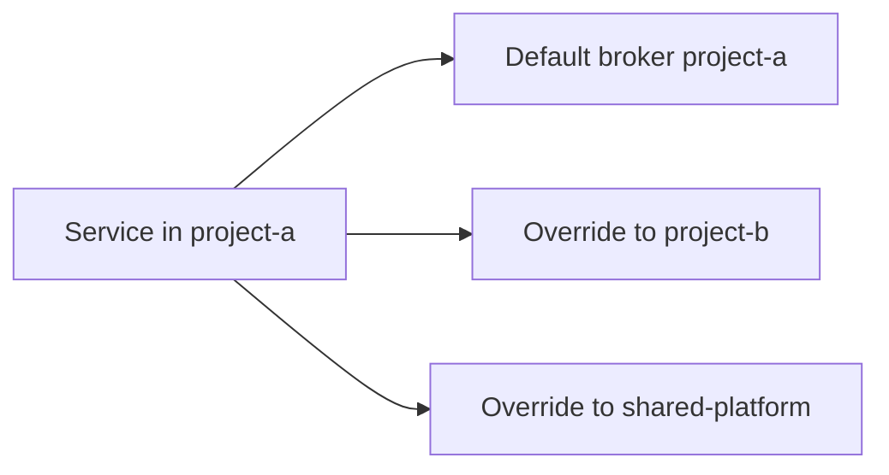

# Cross-Project Configuration

Cross-project messaging allows a FastPubSub service to consume from or publish to Pub/Sub resources outside its default broker project.
This model is common in multi-team organizations where platform events are shared across isolated Google Cloud projects.

## Conceptual Model

FastPubSub starts with a default broker `project_id`.
You can override this default at subscriber, publisher, router, or per-call publish level.



This hierarchy supports localized decisions without duplicating broker instances across modules.

## Subscriber-Level Override

```python
--8<-- "advanced/e1_07_multiple_projects.py:cross_project_subscriber"
```

Use this when only specific subscriptions belong to a foreign project.

## Publisher-Level Override

```python
--8<-- "advanced/e1_07_multiple_projects.py:cross_project_publisher"
```

You can also publish with broker-level API where project is specified per call:

```python
--8<-- "basic_usage/e2_07_cross_project_publish.py:cross_project_broker"
```

## Router-Scoped Project Mapping

Routers are useful when a whole domain maps to the same remote project.

```python
--8<-- "advanced/e1_07_multiple_projects.py:router_cross_project"
```

### Nested Project Scopes

Nested routers can progressively refine scope:

```python
--8<-- "advanced/e1_07_multiple_projects.py:nested_routers"
```

This pattern is useful when organizational boundaries differ by event domain.

## Composite Service Example

```python
--8<-- "advanced/e1_07_multiple_projects.py:complete_example"
```

The service consumes local and shared-platform events while publishing to both contexts.

## IAM Requirements

Cross-project configuration is correct only when IAM allows it.
The service account executing your consumer must have permissions in the target project.

### Subscribe Permissions

```bash
gcloud projects add-iam-policy-binding project-b \
  --member="serviceAccount:my-service@project-a.iam.gserviceaccount.com" \
  --role="roles/pubsub.subscriber"
```

### Publish Permissions

```bash
gcloud projects add-iam-policy-binding project-b \
  --member="serviceAccount:my-service@project-a.iam.gserviceaccount.com" \
  --role="roles/pubsub.publisher"
```

!!! warning "Use Least Privilege"
    Prefer topic/subscription scoped bindings where feasible.
    Project-wide roles are simpler initially but increase blast radius.

## Validation with `PubSubTestClient`

For local checks, validate project routing decisions in published metadata.

```python
--8<-- "advanced/e1_07_multiple_projects.py:cross_project_test_client"
```

This verifies your FastPubSub configuration intent without external infrastructure.

## Design Recommendations

### Naming Convention

Include producer and consumer context in subscription names, for example:

- `project-a-orders-subscription`
- `my-service-user-events-subscription`

Descriptive names reduce ambiguity in audits and incident response.

### Dependency Registry

Maintain a simple mapping document:

- Source project
- Target project
- Topic/subscription
- Owning team
- IAM principal

This materially improves change impact analysis.

### Separate Platform and Product Flows

Where possible, group cross-project routes by router prefix (`platform.*`, `external.*`) to improve code discoverability.

## Common Failure Modes

- Correct code with missing IAM grants in target project.
- Inconsistent naming for cross-project subscriptions.
- Mixing local and cross-project publish paths without explicit project override.
- Forgetting to document ownership boundaries across teams.

## Recap

- FastPubSub supports cross-project routing at subscriber, publisher, router, and per-publish levels.
- IAM is a mandatory part of correctness for cross-project flows.
- Router-level scoping keeps multi-project architectures maintainable.
- `PubSubTestClient` helps validate routing intent in local tests.
- Strong naming and ownership conventions are essential in shared environments.
