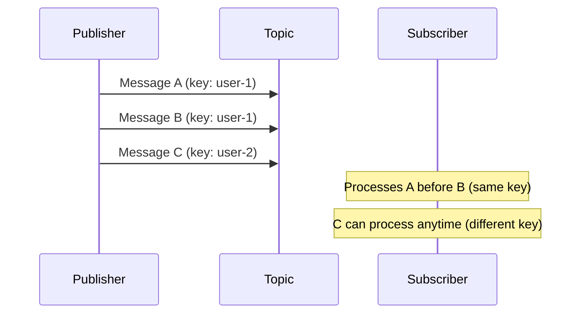
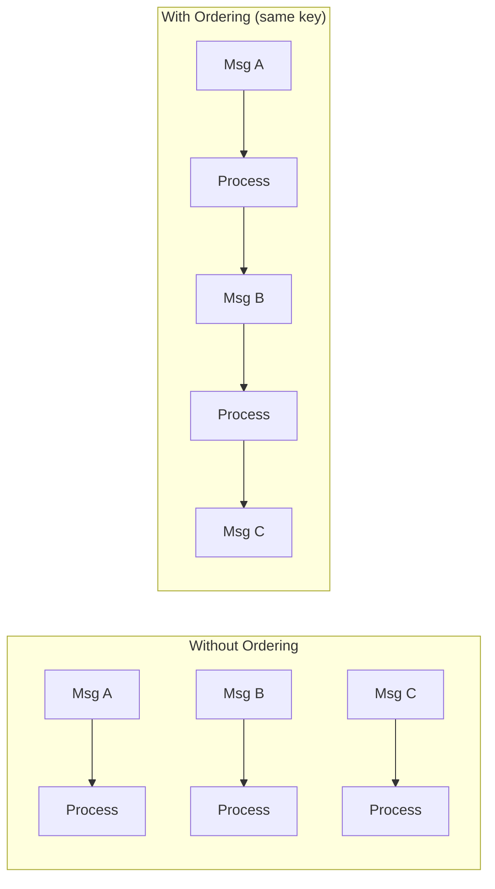

# Message Ordering

Message ordering ensures that messages with the same ordering key are processed in the exact sequence they were published. This is essential when the order of operations matters, like processing a user's actions chronologically.

## Why Order Matters

Consider a user updating their profile:

1. User changes email to `new@example.com`
2. User changes email to `final@example.com`

Without ordering, message 2 might be processed before message 1, leaving the user with the wrong email. Message ordering prevents this.

!!! info "Ordering Key Scope"
    Ordering is guaranteed only for messages with the same ordering key. Messages with different keys can still be processed in parallel and out of order relative to each other.

## How Ordering Works



## Enabling Message Ordering

### Subscriber Configuration

Enable ordering on your subscriber:

```python
from fastpubsub import FastPubSub, PubSubBroker, Message

broker = PubSubBroker(project_id="your-project-id")
app = FastPubSub(broker)

@broker.subscriber(
    alias="user-events-ordered",
    topic_name="user-events",
    subscription_name="user-events-ordered-subscription",
    enable_message_ordering=True,  # (1)!
    autocreate=True,
)
async def process_user_events(message: Message):
    user_id = message.ordering_key  # (2)!
    await update_user_state(user_id, message.data)
```

1. Enables ordered delivery for this subscription
2. Access the ordering key from the message

### Publisher Configuration

The publisher must also have ordering enabled:

```python
# Create an ordered publisher
ordered_publisher = broker.publisher(
    "user-events",
    enable_message_ordering=True  # (1)!
)

# Publish messages with ordering keys
await ordered_publisher.publish(
    data={"action": "login", "user_id": "user-123"},
    ordering_key="user-123"  # (2)!
)

await ordered_publisher.publish(
    data={"action": "update_profile", "user_id": "user-123"},
    ordering_key="user-123"  # (3)!
)
```

1. Publisher must have ordering enabled to use ordering keys
2. First message for user-123
3. Guaranteed to be processed after the login message

!!! warning "Both Sides Must Enable Ordering"
    If the publisher sends messages with ordering keys but the subscriber doesn't have `enable_message_ordering=True`, messages may still arrive out of order.

## Choosing Good Ordering Keys

The ordering key determines which messages are ordered together. Choose keys that group related operations:

=== "User-Scoped"
    ```python
    # All events for a user are ordered
    await publisher.publish(
        data={"action": "purchase", "item": "widget"},
        ordering_key=f"user-{user_id}"
    )
    ```

=== "Resource-Scoped"
    ```python
    # All updates to an order are ordered
    await publisher.publish(
        data={"status": "shipped"},
        ordering_key=f"order-{order_id}"
    )
    ```

=== "Account-Scoped"
    ```python
    # All transactions for an account are ordered
    await publisher.publish(
        data={"type": "credit", "amount": 100},
        ordering_key=f"account-{account_id}"
    )
    ```

### Good Ordering Keys

| Use Case | Ordering Key | Why |
|----------|--------------|-----|
| User actions | `user-{id}` | Actions for one user are ordered |
| Order updates | `order-{id}` | Status changes happen in sequence |
| Inventory | `sku-{id}` | Stock updates for one item are ordered |
| Account transactions | `account-{id}` | Balance updates are sequential |

### Bad Ordering Keys

!!! danger "Avoid These Patterns"
    - **Single global key** (`"all-messages"`) - Forces sequential processing of everything
    - **Too granular** (`"msg-{uuid}"`) - No messages share a key, ordering is useless
    - **Time-based** (`"2024-01-15"`) - Too many messages per key

## Performance Considerations

Ordering reduces parallelism. Messages with the same ordering key are processed sequentially, not concurrently.



!!! tip "Balance Ordering and Throughput"
    Use ordering only when necessary. If messages are independent, let them process in parallel for better throughput.

## Handling Failures with Ordering

When a message fails, subsequent messages with the same ordering key are blocked until the failed message is resolved (retried successfully or moved to dead-letter).

```python
@broker.subscriber(
    alias="ordered-processor",
    topic_name="events",
    subscription_name="events-ordered-subscription",
    enable_message_ordering=True,
    dead_letter_topic="events-dlq",  # (1)!
    max_delivery_attempts=5,
    autocreate=True,
)
async def process_ordered(message: Message):
    await process_event(message.data)
```

1. Failed messages go to DLT after max attempts, unblocking the queue

!!! warning "Blocked Message Queues"
    If a message fails repeatedly without dead-letter handling, all subsequent messages with the same ordering key will be blocked indefinitely. Always configure dead-letter topics for ordered subscriptions.

## Use Cases

=== "User Sessions"
    ```python
    # Track user session events in order
    @broker.subscriber(
        alias="session-tracker",
        topic_name="session-events",
        subscription_name="session-events-subscription",
        enable_message_ordering=True,
    )
    async def track_session(message: Message):
        user_id = message.ordering_key
        event = message.data

        # Events arrive in order: login → page_view → purchase → logout
        await session_store.append_event(user_id, event)
    ```

=== "State Machines"
    ```python
    # Process order state transitions in sequence
    @broker.subscriber(
        alias="order-state",
        topic_name="order-events",
        subscription_name="order-state-subscription",
        enable_message_ordering=True,
    )
    async def process_order_state(message: Message):
        order_id = message.ordering_key
        transition = message.data["transition"]

        # Transitions arrive in order: created → paid → shipped → delivered
        await state_machine.transition(order_id, transition)
    ```

=== "Inventory Updates"
    ```python
    # Process inventory changes in order
    @broker.subscriber(
        alias="inventory-updater",
        topic_name="inventory-events",
        subscription_name="inventory-subscription",
        enable_message_ordering=True,
    )
    async def update_inventory(message: Message):
        sku = message.ordering_key
        delta = message.data["quantity_change"]

        # +10, -5, +3 applied in correct order
        await inventory_db.update_quantity(sku, delta)
    ```

## Best Practices

1. **Combine with Dead-Letter Topics**: Always use dead-letter topics with ordered subscriptions to prevent blocked queues from stalled messages.

2. **Keep Processing Fast**: Slow processing of one message blocks all subsequent messages with the same key. Keep handlers fast or move heavy work to background tasks.

3. **Monitor Queue Depth**: Track how many messages are waiting per ordering key. A growing queue indicates processing bottlenecks.

4. **Test Ordering Behavior**: Write tests that verify your handler processes messages in the correct order. Send multiple messages and check the final state.

## Recap

- **Message ordering** guarantees messages with the same ordering key are processed sequentially
- Enable on **both publisher** (`enable_message_ordering=True`) and **subscriber**
- Choose **meaningful ordering keys** (user_id, order_id, account_id)
- **Trade-off**: Ordering reduces parallelism - use only when order matters
- **Always use dead-letter topics** to prevent blocked queues
- **Next**: Learn about [Performance Tuning](tuning.md) to optimize throughput
