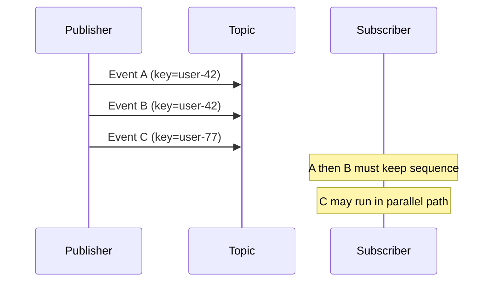
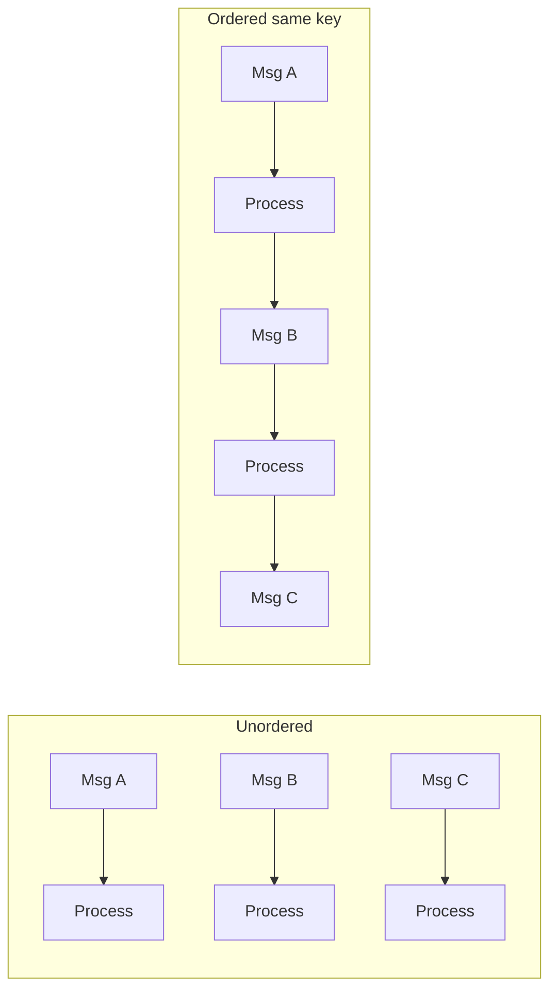

# Message Ordering

Message ordering guarantees relative sequence for messages that share the same ordering key.
This is essential for state-transition workflows where event chronology changes the final outcome.

In FastPubSub, ordered delivery requires coordinated publisher and subscriber configuration.

## Conceptual Model

Ordering is scoped by key, not by topic.

- Messages with the **same key** are processed in publish order.
- Messages with **different keys** may be processed concurrently.



## Subscriber Configuration

```python
--8<-- "advanced/e1_04_ordering.py:ordered_subscriber"
```

`enable_message_ordering=True` enables ordered delivery behavior for the subscription.

## Publisher Configuration

```python
--8<-- "advanced/e1_04_ordering.py:ordered_publisher"
```

The publisher must send `ordering_key` for related events.
For handler logic and observability, include the same business identifier in attributes (for example `user_id`).

!!! warning "Both Ends Matter"
    Ordering requires publisher intent (`ordering_key`) and subscriber ordering configuration.
    Missing either side weakens sequence guarantees.

## Choosing Ordering Keys

Good ordering keys align with entity-level state boundaries.

| Domain | Recommended Key Pattern | Why |
|--------|--------------------------|-----|
| User lifecycle | `user-{id}` | Preserves per-user chronology |
| Order state machine | `order-{id}` | Keeps transitions deterministic |
| Inventory updates | `sku-{id}` | Preserves stock mutation order |
| Account ledger | `account-{id}` | Prevents out-of-order balance effects |

### Anti-Patterns

- Single global key such as `all-events` (destroys parallelism).
- One key per message (provides no ordering value).
- Ephemeral keys unrelated to state boundaries.

## Failure Behavior and Queue Blocking

With ordered delivery, a failed message blocks later messages with the same key.

```python
--8<-- "advanced/e1_04_ordering.py:ordered_with_dlt"
```

For this reason, ordered subscriptions should be paired with dead-letter policy.
Without bounded retries, one poison message can stall an entire entity stream.

## Throughput Implications

Ordering introduces serial execution within each key lane.



Plan capacity around key cardinality:

- More keys usually increase effective parallelism.
- Very hot keys create natural bottlenecks.

## Representative Use Cases

### Session Event Tracking

```python
--8<-- "advanced/e1_04_ordering.py:usecase_sessions"
```

### State Machine Transitions

```python
--8<-- "advanced/e1_04_ordering.py:usecase_state_machine"
```

### Inventory Mutation Stream

```python
--8<-- "advanced/e1_04_ordering.py:usecase_inventory"
```

## Design Recommendations

### Carry Business Keys in Attributes

Even when `ordering_key` is used for transport sequencing, include a readable identifier in attributes for logs,
test assertions, and incident diagnosis.

### Keep Handler Latency Predictable

Long-running handlers delay all subsequent messages for the same key.
Move heavy side work to asynchronous downstream flows when possible.

### Observe Per-Key Backlog

Aggregate queue metrics can look healthy while a single key lane is blocked.
Monitor key-level hotspots where operational tooling allows.

## Common Failure Modes

- Enabling ordering without dead-letter policy and bounded retries.
- Using a global ordering key and unintentionally serializing all traffic.
- Assuming ordering is global across keys instead of key-scoped.
- Ignoring hot-key skew during capacity planning.


## Recap

- Ordering guarantees sequence only for messages that share a key.
- Configure subscriber ordering and publish with `ordering_key`.
- Design keys around entity state boundaries.
- Pair ordering with dead-letter policy to avoid indefinite blocking.
- Treat ordering as a correctness tool with explicit throughput trade-offs.
