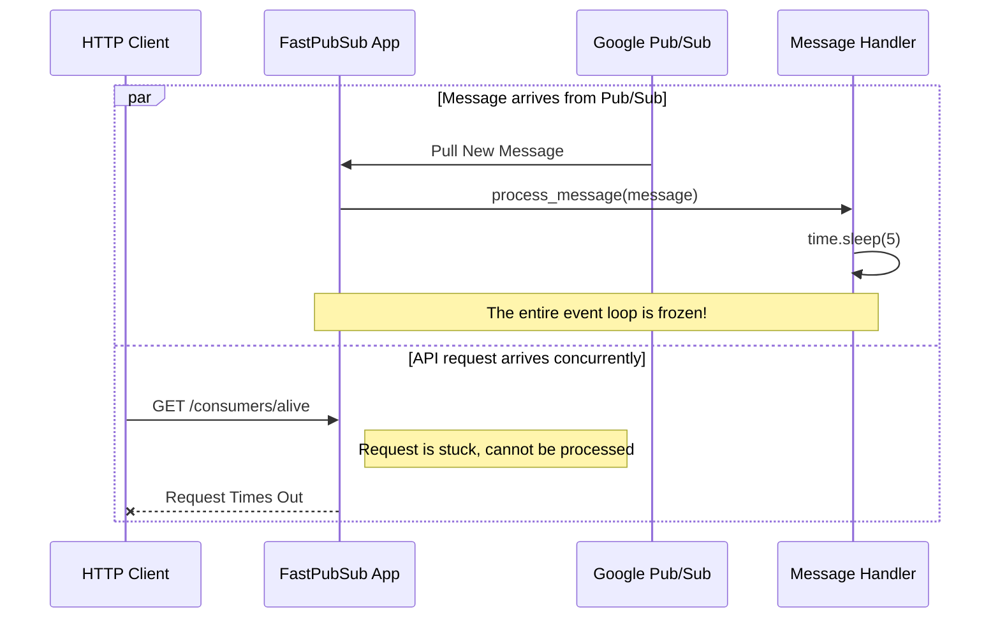
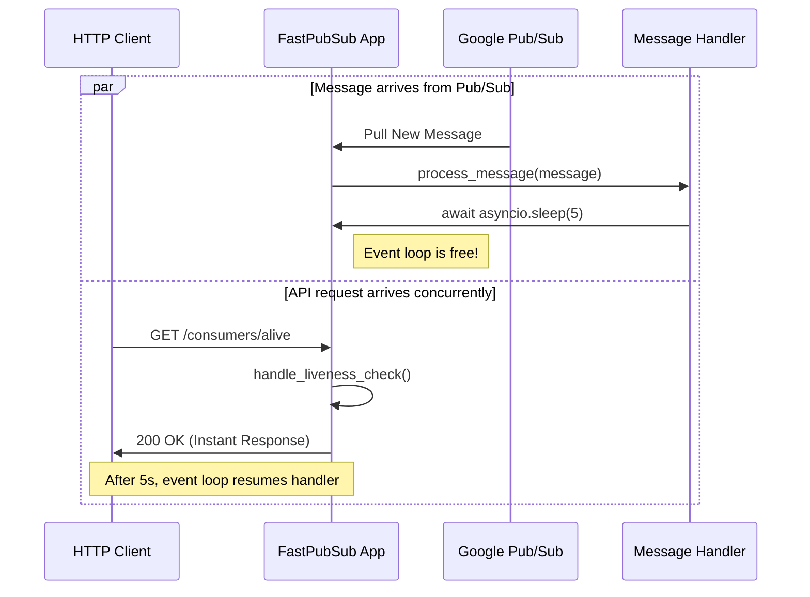

# Introduction to Async/Await in Python

FastPubSub is an **asyncio-native** framework. All message handlers and most APIs are asynchronous. This guide covers the fundamental concepts you need to work effectively with FastPubSub.

## What is Async/Await?

Asynchronous programming allows your application to handle multiple tasks concurrently within a single thread. Instead of waiting for a task to complete before moving to the next one (blocking), asynchronous code can pause a task, work on something else, and resume the original task later.

In Python, asynchronous programming uses the `async` and `await` keywords:

- **`async def`**: Defines an asynchronous function (coroutine)
- **`await`**: Pauses execution until the awaited operation completes, allowing other tasks to run

## Why FastPubSub Requires Async

FastPubSub runs on a single-threaded event loop managed by `asyncio`. This single thread efficiently juggles multiple tasks:

- Processing incoming Pub/Sub messages from multiple subscriptions
- Serving HTTP requests (when using FastAPI integration)
- Publishing messages to topics
- Running background tasks and health checks

Tasks can only be paused when they encounter an `await` keyword. This yields control back to the event loop, allowing it to switch to another task.

!!! warning "Blocking Operations"

    Without async/await, if one task blocks (using `time.sleep()` or a synchronous database call), the entire thread freezes. No other tasks can run, causing your application to become unresponsive.

## The Event Loop

Think of the event loop as a task scheduler running in a single thread. It maintains a queue of tasks and switches between them when they yield control with `await`.

```python
import asyncio

async def task_one():
    print("Task 1: Starting")
    await asyncio.sleep(2)  # Yields control to event loop
    print("Task 1: Finished")

async def task_two():
    print("Task 2: Starting")
    await asyncio.sleep(1)  # Yields control to event loop
    print("Task 2: Finished")

async def main():
    # Run both tasks concurrently
    await asyncio.gather(task_one(), task_two())

# Output:
# Task 1: Starting
# Task 2: Starting
# Task 2: Finished  (after 1 second)
# Task 1: Finished  (after 2 seconds total)
```

Both tasks run concurrently on a single thread because they use `await`, which allows the event loop to switch between them.

---

## Blocking vs Non-Blocking

Understanding the difference between blocking and non-blocking operations is essential for building responsive applications.

### Blocking Operations

Blocking calls freeze the entire event loop. Other tasks, like incoming HTTP requests or message processing, stall until the blocking call finishes.

```python
import time
from fastpubsub import PubSubBroker, Message

broker = PubSubBroker(project_id="your-project-id")

@broker.subscriber(
    alias="slow-handler",
    topic_name="user-events",
    subscription_name="user-events-subscription",
)
async def process_message(message: Message):
    print(f"Processing message {message.id}")

    # BAD: This blocks the entire event loop for 5 seconds!
    time.sleep(5)

    print(f"Finished message {message.id}")
```

**What happens:**

1. The handler starts processing a message
2. `time.sleep(5)` blocks the entire thread for 5 seconds
3. During this time, no other messages can be processed
4. HTTP health checks will timeout
5. The application appears frozen



### Non-Blocking Operations

Non-blocking calls with `await` yield control back to the event loop, allowing it to work on other tasks while waiting for the operation to complete.

```python
import asyncio
from fastpubsub import PubSubBroker, Message

broker = PubSubBroker(project_id="your-project-id")

@broker.subscriber(
    alias="fast-handler",
    topic_name="user-events",
    subscription_name="user-events-subscription",
)
async def process_message(message: Message):
    print(f"Processing message {message.id}")

    # GOOD: This yields control to the event loop
    await asyncio.sleep(5)

    print(f"Finished message {message.id}")
```

**What happens:**

1. The handler starts processing a message
2. `await asyncio.sleep(5)` pauses the handler and yields control to the event loop
3. During this time, other messages can be processed and HTTP requests can be handled
4. After 5 seconds, the event loop resumes the handler where it left off



---

## Common Async Patterns in FastPubSub

### Async Message Handlers

All message handlers must be `async def` functions:

```python
from fastpubsub import PubSubBroker, Message

broker = PubSubBroker(project_id="your-project-id")

@broker.subscriber(
    alias="my-handler",
    topic_name="events",
    subscription_name="events-subscription",
)
async def handle_event(message: Message):
    # Process the message asynchronously
    data = message.data.decode("utf-8")
    await process_data(data)
```

### Async Publishing

Publishing messages is an async operation:

```python
from fastpubsub import FastPubSub, PubSubBroker

broker = PubSubBroker(project_id="your-project-id")
app = FastPubSub(broker)

@app.post("/events/")
async def create_event(data: dict):
    # Use await when publishing
    await broker.publish(
        topic_name="events",
        data=data
    )
    return {"status": "published"}
```

### Async Database Calls

When working with databases, always use async drivers:

```python
from fastpubsub import PubSubBroker, Message
import asyncpg  # Async PostgreSQL driver

broker = PubSubBroker(project_id="your-project-id")

@broker.subscriber(
    alias="save-to-db",
    topic_name="user-events",
    subscription_name="user-events-subscription",
)
async def save_user(message: Message):
    pool = await asyncpg.create_pool("postgresql://...")

    # Async database query
    async with pool.acquire() as conn:
        await conn.execute(
            "INSERT INTO events (data) VALUES ($1)",
            message.data
        )
```

### Async HTTP Calls

Use async HTTP clients like `httpx`:

```python
from fastpubsub import PubSubBroker, Message
import httpx

broker = PubSubBroker(project_id="your-project-id")

@broker.subscriber(
    alias="webhook-handler",
    topic_name="notifications",
    subscription_name="notifications-subscription",
)
async def send_webhook(message: Message):
    # Async HTTP request
    async with httpx.AsyncClient() as client:
        response = await client.post(
            "https://api.example.com/webhook",
            json={"data": message.data.decode("utf-8")}
        )
```

---

## Common Pitfalls

### Forgetting `await`

```python
# BAD: Missing await
async def handler(message: Message):
    broker.publish("topic", data)  # Returns a coroutine, doesn't publish!

# GOOD: With await
async def handler(message: Message):
    await broker.publish("topic", data)  # Actually publishes
```

### Using Blocking Libraries

```python
# BAD: Using synchronous libraries
import requests  # Synchronous HTTP library

async def handler(message: Message):
    # This blocks the event loop!
    response = requests.get("https://api.example.com")

# GOOD: Using async libraries
import httpx  # Async HTTP library

async def handler(message: Message):
    async with httpx.AsyncClient() as client:
        response = await client.get("https://api.example.com")
```

### Blocking I/O Operations

```python
# BAD: Blocking file I/O
async def handler(message: Message):
    with open("file.txt", "r") as f:  # Blocks!
        data = f.read()

# GOOD: Async file I/O
import aiofiles

async def handler(message: Message):
    async with aiofiles.open("file.txt", "r") as f:
        data = await f.read()
```

### CPU-Intensive Operations

For CPU-bound tasks (heavy computation, image processing, encryption), you have two options:

**Option 1: Use Multiple Workers (Recommended)**

Run multiple worker processes to distribute CPU-bound work:

```bash
# Run with 4 worker processes
fastpubsub run app:app --workers 4
```

Each worker is a separate process with its own event loop, allowing true parallel CPU utilization.

**Option 2: Use ProcessPoolExecutor**

For occasional CPU-heavy operations, offload the work to a separate process:

```python
import asyncio
from concurrent.futures import ProcessPoolExecutor
from fastpubsub import PubSubBroker, Message

broker = PubSubBroker(project_id="your-project-id")
executor = ProcessPoolExecutor(max_workers=4)

def cpu_intensive_task(data):
    # Heavy computation runs in a separate process
    result = complex_calculation(data)
    return result

@broker.subscriber(
    alias="compute-handler",
    topic_name="compute-tasks",
    subscription_name="compute-tasks-subscription",
)
async def process_compute(message: Message):
    # Run CPU-bound work in a separate process
    loop = asyncio.get_event_loop()
    result = await loop.run_in_executor(executor, cpu_intensive_task, message.data)
    print(f"Result: {result}")
```

---

## Running Async Code

FastPubSub handles the event loop for you. Define your async handlers and run the application:

```bash
fastpubsub run app:app
```

If you need to run async code outside of FastPubSub (in a script), use `asyncio.run()`:

```python
import asyncio
from fastpubsub import PubSubBroker

async def main():
    broker = PubSubBroker(project_id="your-project-id")
    await broker.publish("topic", data={"message": "Hello"})

# Run the async function
asyncio.run(main())
```

---

## Learning Resources

To deepen your understanding of async/await in Python:

- [Python Documentation: Coroutines and Tasks](https://docs.python.org/3/library/asyncio-task.html)
- [Real Python: Async IO in Python](https://realpython.com/async-io-python/)
- [FastAPI: Concurrency and async/await](https://fastapi.tiangolo.com/async/)

---

## Recap

- **Async/await** enables concurrent programming in a single thread using an event loop
- **FastPubSub requires async** handlers because it's built on asyncio for high performance
- **`await` is crucial**: It yields control to the event loop, keeping your app responsive
- **Avoid blocking calls**: Use async libraries for I/O operations (HTTP, database, files)
- **CPU-intensive tasks**: Use multiple workers or `ProcessPoolExecutor`
- **Common mistake**: Forgetting `await` or using synchronous libraries in async code

Understanding async/await is essential for building fast, responsive applications with FastPubSub. Once you grasp these concepts, you can handle thousands of messages concurrently.
