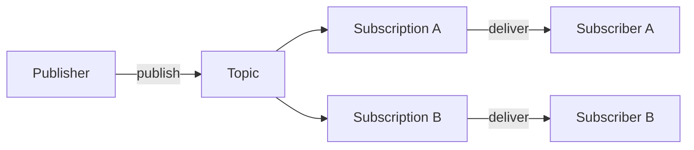

# Introduction to Google Pub/Sub

Google Cloud Pub/Sub is a fully-managed, real-time messaging service designed for asynchronous communication between independent applications. This guide covers the concepts you need to understand before working with FastPubSub.

## What is Google Pub/Sub?

Pub/Sub's primary function is to **decouple** services that produce events (Publishers) from services that process them (Subscribers). This separation creates a robust and scalable architecture where producers send data without knowing who will receive it or when it will be processed.

## Core Components

| Component | Description |
|-----------|-------------|
| **Message** | Contains a data payload and optional metadata (attributes) |
| **Topic** | A named channel for a category of events (e.g., `new-orders`, `user-signups`) |
| **Subscription** | A named resource representing a stream of messages from a single topic |
| **Publisher** | An application that creates and sends messages to a topic |
| **Subscriber** | An application that receives messages from a subscription |

A topic can have multiple subscriptions, allowing the same stream of events to be consumed independently by different applications.

---

## Message Delivery Guarantees

### At-Least-Once Delivery

Pub/Sub guarantees **at-least-once message delivery** through an acknowledgment system:

1. When a subscriber receives a message, Pub/Sub considers it "in flight"
2. The subscriber has a configurable **acknowledgment deadline** to process the message
3. If the subscriber sends an **ack**, the message is permanently removed
4. If the deadline expires without an ack, Pub/Sub redelivers the message

Subscribers can also send a **negative acknowledgment (nack)** to request immediate redelivery.

### Dead-Letter Topics

A subscription can be configured with a **Dead-Letter Topic (DLT)**. After a set number of delivery attempts, Pub/Sub forwards the failed message to this separate topic for inspection. This prevents a single bad message from blocking the processing pipeline.

---

## Communication Patterns

The architecture of topics and subscriptions enables flexible communication patterns:

### One-to-Many (Fan-out)

A single message published to a topic is delivered to multiple subscriber systems, each with its own subscription. Different services react to the same event in parallel.

**Example:** An `order-placed` event sent to inventory, notification, and analytics services simultaneously.

### Many-to-One (Fan-in)

Multiple publisher systems send messages to a single topic, processed by a single subscriber service. This centralizes and aggregates data from various sources.

**Example:** Collecting logs from a fleet of microservices into one processing pipeline.

### Many-to-Many

Combines both patterns. Multiple publishers send messages to a topic, and multiple subscriber systems consume these events for distinct purposes.

---

## Subscription Delivery Types

Pub/Sub offers three delivery methods for subscribers.

### Push Delivery

Pub/Sub initiates contact and sends messages to your subscriber at a pre-configured webhook endpoint.

**How it works:** Pub/Sub sends a POST request with the message data to your HTTPS URL. Your application acknowledges by returning HTTP status codes (e.g., `200 OK`).

**When to use:** Serverless applications or REST APIs designed to receive webhooks.

**Considerations:** Requires a publicly accessible HTTPS endpoint. The subscriber has no control over delivery rate, making it vulnerable to message bursts.

### Synchronous Pull

A classic request-response model where your application explicitly requests messages from Pub/Sub.

**How it works:** The subscriber client calls a method to request a batch of messages. Your code is responsible for the polling loop and acknowledging each message.

**When to use:** Short-lived jobs, simple scripts, or scenarios requiring fine-grained control over message consumption.

**Considerations:** Requires managing the entire message lifecycle, including exception handling and ack deadline extensions.

### Streaming Pull (Recommended)

The most performant option. Establishes a long-lived, bidirectional gRPC stream between your client and Pub/Sub.

**How it works:** High-level client libraries abstract the complexity. You register a callback function, and the library manages the persistent stream, flow control, and acknowledgments.

**When to use:** Long-running services requiring high throughput and low latency. This is the standard for building robust subscriber applications.

!!! info "FastPubSub Uses Streaming Pull"

    FastPubSub implements the streaming pull pattern with an asyncio-based approach, providing high performance with Python's async/await model.

---

## Pub/Sub vs. Kafka: Parallelism Model

Pub/Sub handles parallelism differently from Apache Kafka.

### Kafka's Partition-Based Model

Kafka's parallelism is based on **partitions**. A topic is divided into a fixed number of partitions. Within a consumer group, each partition can only be assigned to a single consumer. Maximum parallelism equals the partition count. Scaling beyond this limit requires manually increasing partitions.

### Pub/Sub's Per-Message Model

Pub/Sub uses **per-message parallelism**. It abstracts partitions away, load-balancing individual messages across all available subscriber clients. This allows massive, fine-grained scaling without manual intervention.

You can have thousands of subscriber clients pulling from the same subscription, and Pub/Sub automatically distributes the workload. Scaling your consumer fleet up or down is simpler and more fluid.

---

## Key Configuration Options

When configuring subscriptions, these options affect behavior:

| Option | Description |
|--------|-------------|
| `ack_deadline_seconds` | Time your handler has to acknowledge a message |
| `filter_expression` | Server-side filter to receive only matching messages |
| `dead_letter_topic` | Topic for messages that fail after max attempts |
| `max_delivery_attempts` | Attempts before sending to dead-letter topic |
| `enable_message_ordering` | Process messages with the same key in order |
| `enable_exactly_once_delivery` | Guarantee no duplicate processing |

---

## Recap

- **Core Purpose**: Pub/Sub decouples event producers (Publishers) from consumers (Subscribers) using Topics and Subscriptions
- **Reliability**: At-least-once delivery through an acknowledgment system (ack/nack). Failed messages can go to a Dead-Letter Topic
- **Communication Patterns**: Fan-out (one-to-many), fan-in (many-to-one), and many-to-many
- **Delivery Types**:
    - **Push**: Pub/Sub sends messages to a webhook (ideal for serverless)
    - **Synchronous Pull**: Client explicitly requests messages (good for simple jobs)
    - **Streaming Pull**: Persistent connection streams messages with low latency (recommended)
- **Scalability**: Dynamic per-message parallelism allows fluid scaling without managing partitions

For more details, refer to the [Google Cloud Pub/Sub documentation](https://cloud.google.com/pubsub/docs/pubsub-basics).
