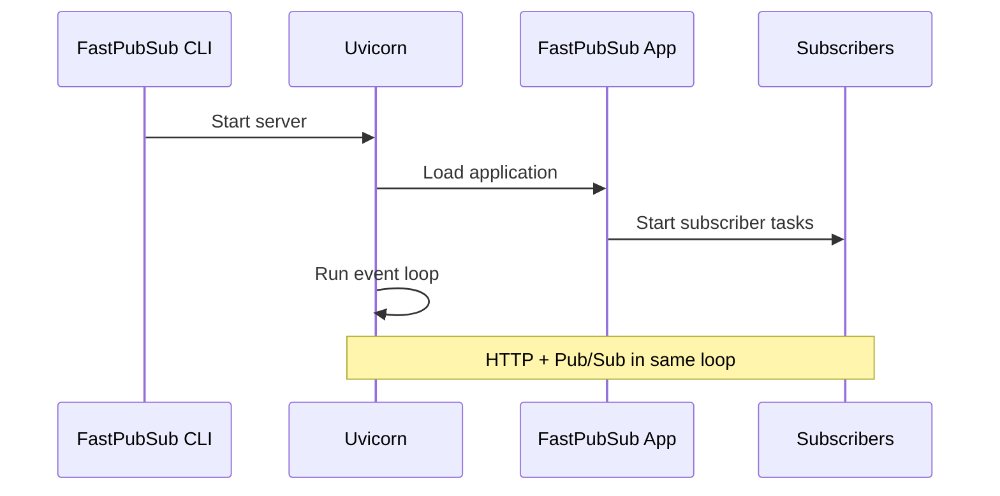
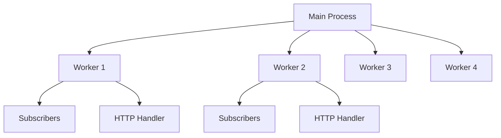
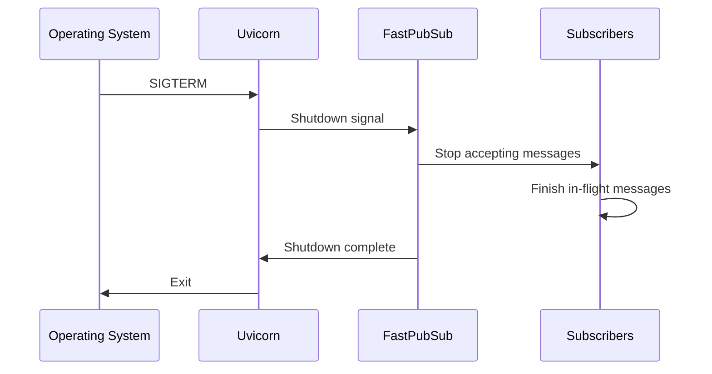

# Uvicorn Integration

FastPubSub uses [Uvicorn](https://www.uvicorn.org/) as its ASGI server. Uvicorn handles the HTTP server, process management, and hot-reloading, while FastPubSub manages Pub/Sub subscribers as background tasks within the event loop.

## How FastPubSub Uses Uvicorn

When you run `fastpubsub run`, here's what happens:



1. The CLI validates configuration and credentials
2. Uvicorn starts and loads your FastPubSub application
3. Your app's startup hooks run, starting subscriber background tasks
4. Uvicorn runs the event loop, handling both HTTP and Pub/Sub

---

## Step-by-Step

1. Set credentials or emulator host.
2. Run `fastpubsub run module:app`.
3. Use CLI flags to configure host, port, and workers.
4. Confirm subscribers started in the logs.

## Server Configuration

Control the HTTP server using CLI options:

```bash
# Change host and port
fastpubsub run myapp:app --host 0.0.0.0 --port 8080

# Set log level for Uvicorn
fastpubsub run myapp:app --server-log-level warning
```

### CLI Options for Uvicorn

| Option | Environment Variable | Default | Description |
|--------|---------------------|---------|-------------|
| `--host`, `-h` | `FASTPUBSUB_SERVER_HOST` | `127.0.0.1` | Server host address |
| `--port`, `-p` | `FASTPUBSUB_SERVER_PORT` | `8000` | Server port |
| `--workers`, `-w` | `FASTPUBSUB_WORKERS` | `1` | Number of worker processes |
| `--reload`, `-r` | `FASTPUBSUB_ENABLE_HOT_RELOAD` | `false` | Enable hot-reload |
| `--server-log-level` | `FASTPUBSUB_SERVER_LOG_LEVEL` | `info` | Uvicorn log level |

## Worker Process Model

Uvicorn can run multiple worker processes for better performance and reliability:

```bash
# Run with 4 workers
fastpubsub run myapp:app --workers 4
```

### How Workers Function



Each worker process:

- Runs its own copy of your application
- Has independent subscriber tasks
- Handles HTTP requests independently
- Has its own memory space

!!! info "Subscriber Scaling"
    With 4 workers, each subscriber runs 4 times (once per worker). Pub/Sub distributes messages across all instances automatically.

### Worker Guidelines

| Scenario | Recommended Workers |
|----------|---------------------|
| Development | 1 (with `--reload`) |
| Light production load | 2-4 |
| Heavy production load | Number of CPU cores |
| Container with 1 vCPU | 1-2 |

```bash
# Calculate based on CPU cores
fastpubsub run myapp:app --workers $(nproc)
```

!!! warning "Workers with --reload"
    The `--workers` option is ignored when `--reload` is enabled. Hot-reloading runs a single process.

## Hot-Reload for Development

Enable automatic restarts when files change:

```bash
fastpubsub run myapp:app --reload
```

Uvicorn watches for file changes in your project directory and restarts the application when you save a file.

!!! tip "Development Only"
    Only use `--reload` during development. It adds overhead and isn't suitable for production.

## Graceful Shutdown

FastPubSub integrates with Uvicorn's shutdown process:



### Shutdown Timeout

Configure how long to wait for in-flight messages:

```python
broker = PubSubBroker(
    project_id="your-project-id",
    shutdown_timeout=30.0  # (1)!
)
```

1. Wait up to 30 seconds for messages to complete

!!! warning "Set an Appropriate Timeout"
    If your handlers take longer than the timeout, messages may be nacked and redelivered. Set the timeout higher than your longest expected processing time.

## Environment Variables

Configure Uvicorn through environment variables instead of CLI flags:

```bash
# Server configuration
export FASTPUBSUB_SERVER_HOST=0.0.0.0
export FASTPUBSUB_SERVER_PORT=8080
export FASTPUBSUB_WORKERS=4
export FASTPUBSUB_SERVER_LOG_LEVEL=warning

# Run without CLI flags
fastpubsub run myapp:app
```

This is useful for:

- Container deployments
- CI/CD pipelines
- Configuration management systems

## Running in Containers

For Docker/Kubernetes deployments:

```dockerfile
FROM python:3.12-slim

WORKDIR /app
COPY . .
RUN pip install fastpubsub

# Use environment variables for configuration
ENV FASTPUBSUB_SERVER_HOST=0.0.0.0
ENV FASTPUBSUB_SERVER_PORT=8080

EXPOSE 8080

CMD ["fastpubsub", "run", "myapp:app"]
```

### Kubernetes Considerations

```yaml
apiVersion: apps/v1
kind: Deployment
spec:
  template:
    spec:
      containers:
      - name: myapp
        image: myapp:latest
        env:
        - name: FASTPUBSUB_SERVER_HOST
          value: "0.0.0.0"
        - name: FASTPUBSUB_SERVER_PORT
          value: "8080"
        - name: FASTPUBSUB_WORKERS
          value: "2"
        ports:
        - containerPort: 8080
        livenessProbe:
          httpGet:
            path: /consumers/alive
            port: 8080
        readinessProbe:
          httpGet:
            path: /consumers/ready
            port: 8080
```

## Direct Uvicorn Usage

FastPubSub applications must be started with the `fastpubsub run` CLI. The CLI wires in subscriber startup, validates credentials, and applies FastPubSub-specific configuration. Running `uvicorn` directly is not supported and will skip required FastPubSub initialization.

## Best Practices

1. **Use Multiple Workers in Production:** Running multiple workers improves reliability. If one worker crashes, others continue serving.
2. **Set Resource Limits:** In containers, limit CPU and memory. Uvicorn workers share the container's resources.
3. **Monitor Worker Health:** Use the built-in health endpoints (`/consumers/alive`, `/consumers/ready`) to monitor each worker.

## Recap

- FastPubSub uses **Uvicorn** as its ASGI server
- **Workers** (`--workers`) run multiple processes for better performance
- **Hot-reload** (`--reload`) enables automatic restarts during development
- **Graceful shutdown** waits for in-flight messages to complete
- Use **environment variables** for container deployments
- Built-in **health endpoints** integrate with Kubernetes probes
