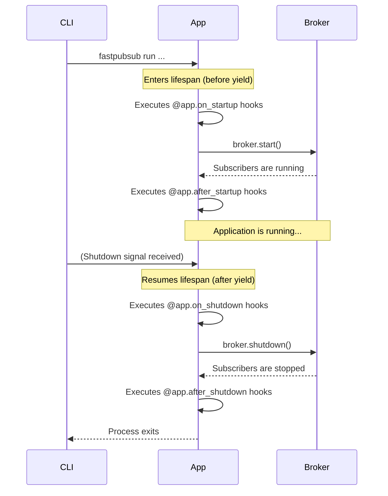

# Lifespan and Hooks

FastPubSub manages the application lifecycle using a built-in lifespan event handler. This implementation is based on the standard [FastAPI lifespan context manager](https://fastapi.tiangolo.com/advanced/events/) and runs the broker and subscribers within the same event loop as the web server.

When your FastPubSub application starts, the internal lifespan function handles starting and stopping the broker. It provides four hook decorators for adding custom logic at specific moments.

## The Four Event Hooks

### `@app.on_startup`

Runs after the application process starts but **before** `broker.start()` is called.

**Use it for:** Setting up essential resources that subscribers need before they start pulling messages.

```python
--8<-- "basic_usage/e6_01_lifespan_hooks.py:on_startup"
```

### `@app.after_startup`

Runs immediately **after** `broker.start()` completes successfully. Subscribers are now running and polling for messages.

**Use it for:** Logic that needs to interact with the active broker or subscribers.

```python
--8<-- "basic_usage/e6_01_lifespan_hooks.py:after_startup"
```

### `@app.on_shutdown`

Runs when the application receives a shutdown signal (e.g., `SIGTERM`), but **before** `broker.shutdown()` is called. Subscribers are still running.

**Use it for:** Initiating graceful shutdown. Set a flag to tell long-running handlers to finish up.

```python
--8<-- "basic_usage/e6_01_lifespan_hooks.py:on_shutdown"
```

### `@app.after_shutdown`

Runs **after** `broker.shutdown()` completes and all subscriber tasks have stopped. This is the last FastPubSub code to execute.

**Use it for:** Final cleanup and releasing resources created in `on_startup`.

```python
--8<-- "basic_usage/e6_01_lifespan_hooks.py:after_shutdown"
```

---

## Execution Order

The lifecycle follows a strict order. The `on_*` hooks run before the broker action, and `after_*` hooks run after.



---

## Custom Lifespan

For advanced use cases, pass a custom lifespan context manager to FastPubSub. The built-in lifecycle (including all four hooks and broker start/stop) executes within the `yield` block of your custom function.

```python
--8<-- "basic_usage/e6_02_custom_lifespan.py"
```

This separates global resources (HTTP client) from broker-specific logic.

---

## Step-by-Step

1. Define a custom lifespan context manager.
2. Allocate global resources before `yield`.
3. Let FastPubSub run its built-in lifecycle inside `yield`.
4. Clean up resources after `yield`.

---

## Recap

- **Built on FastAPI's Lifespan**: FastPubSub uses a built-in function that follows the standard lifespan context manager pattern
- **Four hooks for precise control**:
    - `on_startup`: Before broker starts
    - `after_startup`: After broker starts
    - `on_shutdown`: Before broker stops
    - `after_shutdown`: After broker stops
- **Custom lifespan support**: Pass your own lifespan function for advanced resource management
