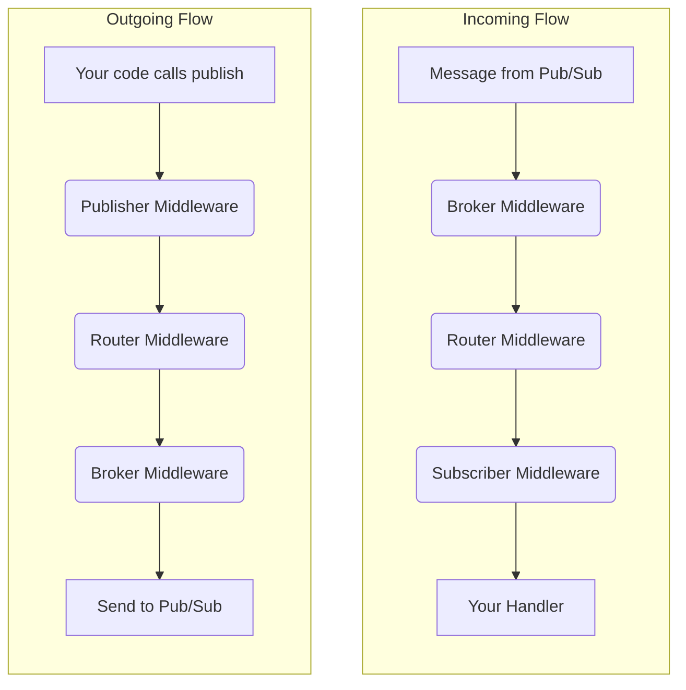

# Middlewares

A "middleware" is a function that runs on every message received before it is processed by any specific subscriber handler and with every end of processing. The FastPubSub's middleware system intercepts and processes incoming messages before they reach your handler, and outgoing messages before they're sent. Middlewares are ideal for implementing cross-cutting concerns without cluttering business logic.

## How Middlewares Work

Think of middlewares as layers of an onion:

- **Incoming messages**: Start at the outermost layer and travel inward through each middleware until reaching your handler
- **Outgoing messages**: Start at the core (your code) and travel outward through the stack before being sent to Pub/Sub

## Common Use Cases

- Adding contextual logging for every message
- Measuring processing time with metrics and tracing
- Validating authentication tokens
- Automatically adding trace IDs to outgoing messages
- Implementing global error handling

---

## Creating Middlewares

Inherit from `BaseMiddleware` and implement one or both methods:

- `async def on_message(...)`: Intercepts incoming messages
- `async def on_publish(...)`: Intercepts outgoing messages

!!! warning "Always Call Super"

    You must call `await super().on_message(...)` or `await super().on_publish(...)` to pass control to the next middleware. Without this, the chain breaks and the application fails.

### Example: Logging Middleware

```python
--8<-- "middlewares/e4_01_full_logging_middleware.py:logging_middleware"
```

### Example: Built-In GZip Middleware

```python
--8<-- "middlewares/e1_01_common_middlewares.py:gzip_middleware_setup"
```

Use this built-in middleware for payload compression instead of implementing custom compression logic.

---

## Step-by-Step

1. Inherit from `BaseMiddleware`.
2. Implement `on_message` and/or `on_publish`.
3. Call `await super().on_message(...)` or `await super().on_publish(...)`.
4. Register the middleware at the desired level.

---

## Applying Middlewares

Middlewares can be applied at four levels, from broadest to most specific.

### Broker Level (Global)

Applied to all subscribers and publishers in the application.


=== "Via include_middleware function"

    ```python
    --8<-- "middlewares/e4_02_broker_level_middleware.py:broker_include_middleware"
    ```

=== "Via constructor"

    ```python
    --8<-- "middlewares/e4_02_broker_level_middleware.py:broker_constructor_middleware"
    ```

### Router Level

Applied to all subscribers and publishers in a specific router (and its nested routers):

=== "Via include_middleware function"

    ```python
    --8<-- "middlewares/e4_03_router_level_middleware.py:router_include_middleware"
    ```

=== "Via constructor"

    ```python
    --8<-- "middlewares/e4_03_router_level_middleware.py:router_constructor_middleware"
    ```

### Subscriber Level

Applied to a single subscriber:

```python
--8<-- "middlewares/e4_04_subscriber_level_middleware.py:subscriber_middleware"
```

### Publisher Level

Applied to a dedicated publisher instance:

```python
--8<-- "middlewares/e4_05_publisher_level_middleware.py:publisher_middleware"

--8<-- "middlewares/e4_05_publisher_level_middleware.py:publisher_usage"
```

### The `Middleware` Wrapper

Use the `Middleware(...)` wrapper when you need to pass constructor arguments to a middleware class. It lets you configure a middleware instance at registration time while keeping the registration API consistent.


!!! note "Only one way to add"

    Subscriber and Publisher middlewares can only be added on the constructor functions `subscriber(...)` or `publisher(...)`, respectively. You cannot call `broker.publish(...)` with a middleware.

---

## Common Pitfalls

- Forgetting to call `super()` breaks the chain.
- Adding middleware at the wrong level (broker vs router vs subscriber).
- Doing slow I/O inside middleware without `await`.
- Keeping mutable runtime state inside middleware instances.
- Creating implicit dependencies between middleware classes.

!!! warning "Stateless-First Middleware Design"

    Keep middlewares stateless by default. If you need mutable state (rate limiting counters, dedup markers, distributed locks), store it in dedicated external components and inject those dependencies into each middleware explicitly.

!!! warning "Avoid Cross-Middleware Dependencies"

    Do not rely on middleware A mutating data that middleware B requires to function. This coupling is an anti-pattern and makes chain order brittle. Share state through explicit services instead.

---

## Middleware Hierarchy and Flow

The execution order depends on the message direction:



**Incoming messages**: Broker → Router → Subscriber → Handler

**Outgoing messages**: Publisher → Router → Broker → Pub/Sub

---

## Recap

- **Purpose**: Implement cross-cutting concerns (logging, auth, metrics) without cluttering handlers
- **Dual function**: Intercept incoming messages via `on_message` and outgoing messages via `on_publish`
- **Creating**: Inherit from `BaseMiddleware`, implement `on_message` and/or `on_publish`
- **The `super()` call**: Always call `await super().on_message(...)` or `await super().on_publish(...)` to continue the chain
- **Multiple levels**: Apply at Broker, Router, Subscriber, or Publisher level
- **Execution order**:
    - Incoming: Broker → Router → Subscriber → Handler
    - Outgoing: Publisher → Router → Broker → Pub/Sub
