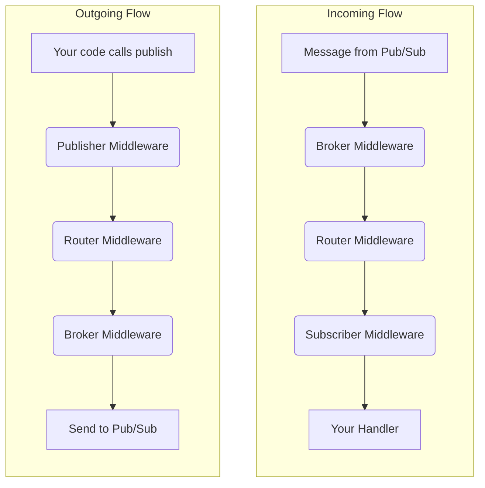

# Middlewares

FastPubSub's middleware system intercepts and processes incoming messages before they reach your handler, and outgoing messages before they're sent. Middlewares are ideal for implementing cross-cutting concerns without cluttering business logic.

## How Middlewares Work

Think of middlewares as layers of an onion:

- **Incoming messages**: Start at the outermost layer and travel inward through each middleware until reaching your handler
- **Outgoing messages**: Start at the core (your code) and travel outward through the stack before being sent to Pub/Sub

## Common Use Cases

- Adding contextual logging for every message
- Measuring processing time with metrics and tracing
- Validating authentication tokens
- Automatically adding trace IDs to outgoing messages
- Implementing global error handling

---

## Creating Middlewares

Inherit from `BaseMiddleware` and implement one or both methods:

- `async def on_message(...)`: Intercepts incoming messages
- `async def on_publish(...)`: Intercepts outgoing messages

!!! warning "Always Call Super"

    You must call `await super().on_message(...)` or `await super().on_publish(...)` to pass control to the next middleware. Without this, the chain breaks and the application fails.

### Example: Logging Middleware

```python
import time
from fastpubsub import Message, BaseMiddleware
from fastpubsub.logger import logger

class FullLoggingMiddleware(BaseMiddleware):

    async def on_message(self, message: Message):
        start_time = time.monotonic()

        try:
            # Call the next middleware or handler
            response = await super().on_message(message)

            processing_time = (time.monotonic() - start_time) * 1000
            logger.info(f"Message processed in {processing_time:.2f}ms")

            return response
        except Exception as e:
            logger.error(
                f"Message {message.id} failed with error: {e}",
                extra={"message_id": message.id}
            )
            # Re-raise to trigger nack
            raise

    async def on_publish(self, data: bytes, ordering_key: str, attributes: dict[str, str] | None):
        logger.info(f"Publishing message with {len(data)} bytes")

        if attributes is None:
            attributes = {}

        # Add a trace ID to all outgoing messages
        attributes["x-trace-id"] = "some-trace-id"

        # Call the next middleware or publisher
        await super().on_publish(data, ordering_key, attributes)
```

---

## Applying Middlewares

Middlewares can be applied at four levels, from broadest to most specific.

### Broker Level (Global)

Applied to all subscribers and publishers in the application.


=== "Via include_middleware function"


    ```python hl_lines="5"
    from fastpubsub import PubSubBroker, Middleware
    from my_app.middlewares import GlobalLoggingMiddleware

    broker = PubSubBroker(project_id="your-project-id")
    broker.include_middleware(GlobalLoggingMiddleware)
    ```

=== "Via constructor"

    ```python hl_lines="6"
    from fastpubsub import PubSubBroker, Middleware
    from my_app.middlewares import GlobalLoggingMiddleware

    broker = PubSubBroker(
        project_id="your-project-id",
        middlewares=[Middleware(GlobalLoggingMiddleware)],
    )
    ```


### Router Level

Applied to all subscribers and publishers in a specific router (and its nested routers):

=== "Via include_middleware function"

    ```python hl_lines="5"
    from fastpubsub import PubSubBroker, PubSubRouter, Middleware
    from my_app.middlewares import UserAuthMiddleware

    users_router = PubSubRouter(prefix="users")
    users_router.include_middleware(UserAuthMiddleware)

    broker = PubSubBroker(project_id="your-project-id")
    broker.include_router(users_router)
    ```

=== "Via constructor"

    ```python hl_lines="6"
    from fastpubsub import PubSubBroker, PubSubRouter, Middleware
    from my_app.middlewares import UserAuthMiddleware

    users_router = PubSubRouter(
        prefix="users",
        middlewares=[Middleware(UserAuthMiddleware)],
    )

    broker = PubSubBroker(project_id="your-project-id")
    broker.include_router(users_router)
    ```


### Subscriber Level

Applied to a single subscriber:

```python
from fastpubsub import FastPubSub, PubSubBroker, Message, Middleware
from my_app.middlewares import DebugMiddleware

broker = PubSubBroker(project_id="your-project-id")
app = FastPubSub(broker)

@broker.subscriber(
    alias="debug-handler",
    topic_name="events",
    subscription_name="events-subscription",
    middlewares=[Middleware(DebugMiddleware)],
)
async def handle_message(message: Message):
    print(message)
```

### Publisher Level

Applied to a dedicated publisher instance:

```python
from fastpubsub import FastPubSub, PubSubBroker, Middleware
from my_app.middlewares import AddTraceMiddleware

broker = PubSubBroker(project_id="your-project-id")
app = FastPubSub(broker)

my_publisher = broker.publisher(
    "events",
    middlewares=[Middleware(AddTraceMiddleware)]
)

@app.after_startup
async def publish_with_trace():
    await my_publisher.publish(data={"hello": "world"})
```


!!! note "Only one way to add"

    The Subscribers and Publishers middlewares can only be added on the constructor functions `subscriber(...)` or `publisher(...)`, respectively. Specifically, you can not call `broker.publish(...)` passing a middleware.

---

## Middleware Hierarchy and Flow

The execution order depends on the message direction:



**Incoming messages**: Broker → Router → Subscriber → Handler

**Outgoing messages**: Publisher → Router → Broker → Pub/Sub

---

## Recap

- **Purpose**: Implement cross-cutting concerns (logging, auth, metrics) without cluttering handlers
- **Dual function**: Intercept incoming messages via `on_message` and outgoing messages via `on_publish`
- **Creating**: Inherit from `BaseMiddleware`, implement `on_message` and/or `on_publish`
- **The `super()` call**: Always call `await super().on_message(...)` or `await super().on_publish(...)` to continue the chain
- **Multiple levels**: Apply at Broker, Router, Subscriber, or Publisher level
- **Execution order**:
    - Incoming: Broker → Router → Subscriber → Handler
    - Outgoing: Publisher → Router → Broker → Pub/Sub
