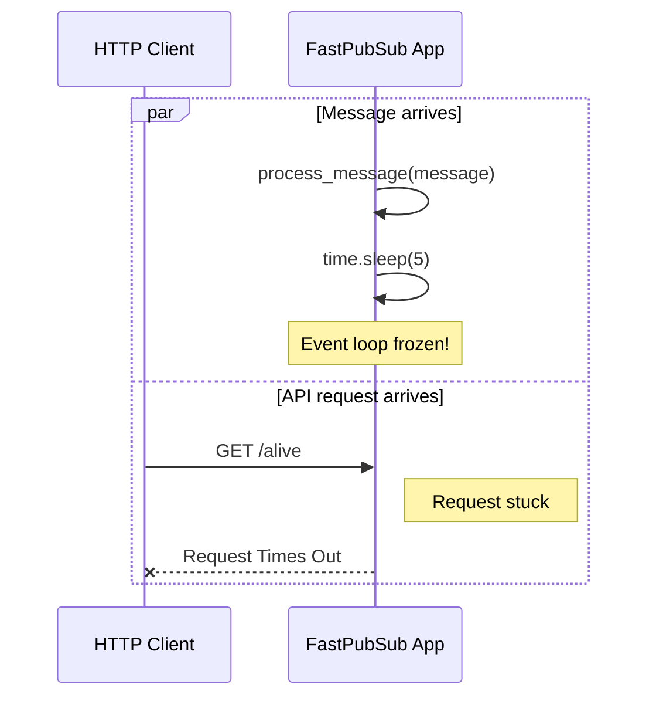
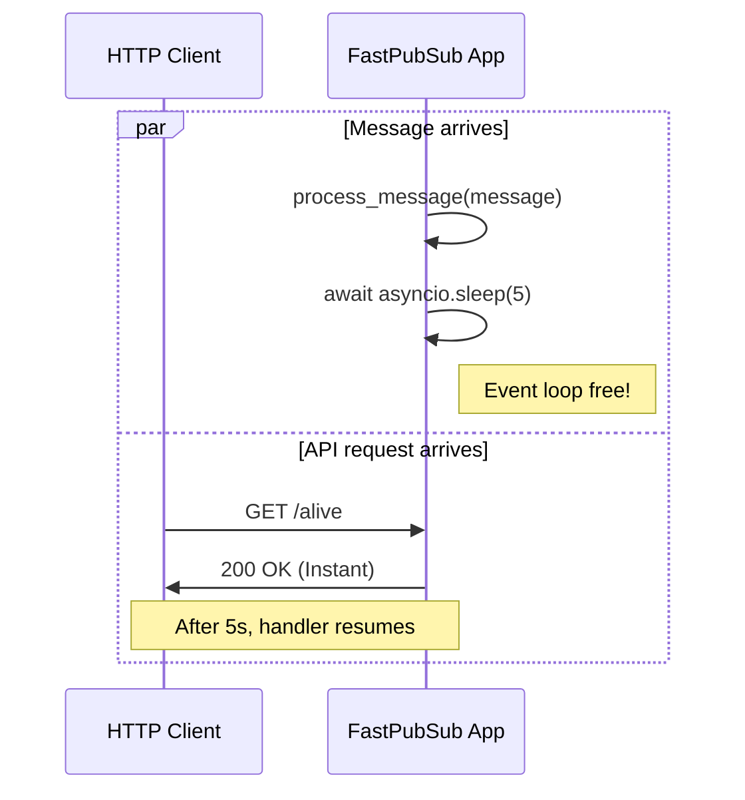

# Subscribers

A **subscriber** is a message handler attached to a Pub/Sub **subscription**. A subscription represents a stream of messages from a specific topic. FastPubSub manages your subscribers using its asyncio-native broker.

## Defining a Subscriber

Use the `@broker.subscriber` decorator to register an async function as a message handler:

```python
from fastpubsub import PubSubBroker, Message

broker = PubSubBroker(project_id="your-project-id")

@broker.subscriber(
    alias="user-handler",
    topic_name="user-events",
    subscription_name="user-events-subscription",
)
async def handle_user_event(message: Message):
    data = message.data.decode("utf-8")
    print(f"Received: {data}")
```

The decorator automatically manages connection, message fetching, and acknowledgment.
You only need to provide `alias`, `topic_name`, and `subscription_name` while rest of the configurations have sensible defaults.

---

## Configuration Options

The `subscriber` register function has a variety of different configuration you can set to fully control the message consumption behavior in case you still need to manipulate them.

```python

@broker.subscriber(
    self,
    alias: str,
    *,
    topic_name: str,
    subscription_name: str,
    project_id: str = "",
    autocreate: bool = True,
    autoupdate: bool = False,
    filter_expression: str = "",
    dead_letter_topic: str = "",
    max_delivery_attempts: int = 5,
    ack_deadline_seconds: int = 60,
    enable_message_ordering: bool = False,
    enable_exactly_once_delivery: bool = False,
    min_backoff_delay_secs: int = 10,
    max_backoff_delay_secs: int = 600,
    max_messages: int = 1000,
    middlewares: Sequence[Middleware] = (),
)
```

Most of the configuration is directly mapped from the Google's PubSub Python SDK. The few exceptions are configuration used for lifecycle control and consumer behavior as we describe them below.


### Lifecycle Control

These settings manage Pub/Sub resource creation on startup.

| Parameter | Description |
|-----------|-------------|
| `autocreate` | If `True`, creates topic and subscription on startup if they don't exist |
| `autoupdate` | If `True`, updates existing subscription configuration to match decorator parameters |

!!! note "autoupdate Limitations"

    **Remember:** Only updatable fields can be changed (see table below) and `autoupdate` won't create a missing topic.

### Subscription Behavior (Server-Side)

These configure the subscription on Google Cloud.

| Parameter | Description | Updatable |
|-----------|-------------|-----------|
| `filter_expression` | Server-side filter for matching messages | Yes |
| `dead_letter_topic` | Topic for failed messages | Yes |
| `max_delivery_attempts` | Attempts before sending to dead-letter topic | Yes |
| `ack_deadline_seconds` | Time to acknowledge before redelivery | Yes |
| `enable_message_ordering` | Process messages with same key in order | No |
| `enable_exactly_once_delivery` | Guarantee no duplicate processing | No |
| `min_backoff_delay_secs` | Initial backoff delay for retries | No |
| `max_backoff_delay_secs` | Maximum backoff delay for retries | No |

### Consumer Behavior (Client-Side)

These control how FastPubSub processes messages.

| Parameter | Description |
|-----------|-------------|
| `max_messages` | Maximum concurrent messages being processed |
| `middlewares` | List of middleware classes to wrap the handler |

---

## The Importance of Async

FastPubSub is an asyncio-native framework, which means your message handlers must be async def functions. This design is critical for performance. An asyncio application runs on a single thread managed by an event loop. This single thread juggles multiple tasks, such as handling incoming Pub/Sub messages and serving HTTP requests (if using the [FastAPI integration](../integrations/fastapi.md)).

A task can only be paused when it encounters an await keyword, allowing the event loop to switch to another task. If you use a blocking operation like `time.sleep()` instead of `await asyncio.sleep()`, you freeze the entire thread. No other tasks can run, causing your application to become unresponsive.

### Blocking (Don't Do This)

As mentioned blocking calls freezes the event loop. Any other tasks, like incoming HTTP requests, will be stalled until the blocking call finishes. The diagram below show an example of such occourence:



**What is happening here:**

1. A message is pulled from Pub/Sub, and the event loop gives control to the Pub/Sub Handler (your function).
2. The handler executes `time.sleep(5)`, a blocking call that freezes the entire thread.
3. While the handler is blocked, a Client sends a `GET /alive` request to the API.
4. The application is completely unresponsive and cannot even begin to process the API request due to event loop being blocked.
5. After a long wait, the client's request times out with the application's performance severely degraded.


### Non-Blocking (Correct)

On the other hand, non-blocking calls with a explicit `await` yields control back to the event loop, allowing it to work on other tasks while waiting for the operation to complete. The diagram below shows how it would play out:



**What is happening here:**

1. A message is pulled, and the event loop gives control to the Pub/Sub Handler.
2. The handler executes `await asyncio.sleep(5)`. The `await` keyword pauses the handler and yields control back to the event loop.
3. While the handler is paused, a Client sends a `GET /alive` request to the API.
4. The event loop is free and immediately processes the request, calls the API endpoint, and returns a `200 OK` response to the client. The API remains fast and responsive.
5. After the 5-second non-blocking sleep is over, the event loop will resume the handler where it left off.


---

## Handling Push Subscriptions

While FastPubSub is designed for high-performance **pull-based** consumption, you can easily handle messages from an existing **push** subscription using its FastAPI integration.

A push subscription sends messages via an HTTP `POST` request to a webhook endpoint. You can create a FastAPI endpoint to receive and process these messages. FastPubSub even provides a Pydantic model, `PushMessage`, to automatically parse the incoming request body.


```python
from fastpubsub import FastPubSub, PubSubBroker, PushMessage
from fastpubsub.logger import logger

broker = PubSubBroker("your-project-id")
app = FastPubSub(broker)

@app.post("/push-handler/")
async def handle_push_message(data: PushMessage):
    logger.info(f"Received push message: {data.message}")
    # Returning 2xx acknowledges the message
    return {"status": "ok"}
```

---

## Recap

In this section, you've learned:

  - How to define a Pub/Sub subscriber declaratively using the `@broker.subscriber` decorator.

  - How to configure a subscription's server-side behavior and client-side handling.

  - Why using non-blocking, `async` code is essential for building responsive applications with FastPubSub.

  - How to receive messages from a push subscription using the FastAPI integration.
