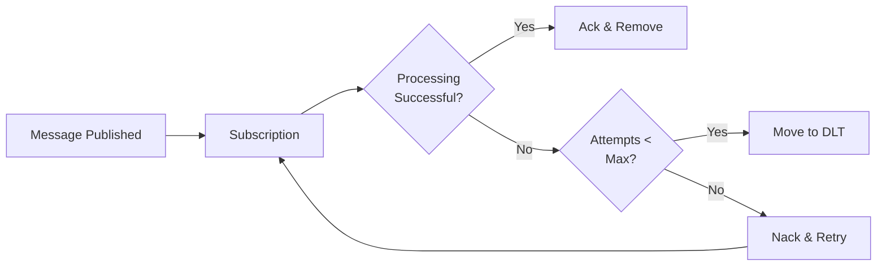

# Advanced Configuration

This guide covers advanced FastPubSub configuration options for building robust, production-ready applications: dead-letter topics, message filtering, exactly-once delivery, message ordering, and performance tuning.

## Dead-Letter Topics (DLT)

Dead-letter topics handle messages that fail processing after a specified number of attempts. This prevents "poison pill" messages from blocking your queue.

### How Dead-Letter Topics Work



### Configuration

```python
from fastpubsub import FastPubSub, PubSubBroker, Message
from fastpubsub.exceptions import Retry

broker = PubSubBroker(project_id="your-project-id")
app = FastPubSub(broker)

@broker.subscriber(
    alias="order-processor",
    topic_name="orders",
    subscription_name="orders-subscription",
    dead_letter_topic="orders-dlq",
    max_delivery_attempts=5,
    min_backoff_delay_secs=10,
    max_backoff_delay_secs=600,
    autocreate=True,
)
async def process_order(message: Message):
    # Failures are retried up to 5 times, then sent to DLQ
    await process_payment(message.data)
```

### Handle Dead-Letter Messages

```python
@broker.subscriber(
    alias="dlq-handler",
    topic_name="orders-dlq",
    subscription_name="orders-dlq-subscription",
    autocreate=True,
)
async def handle_failed_orders(message: Message):
    logger.error(f"Message {message.id} failed permanently", extra={
        "message_data": message.data.decode("utf-8"),
        "attributes": message.attributes,
    })
    await send_alert_to_ops_team(message)
    await store_failed_message(message)
```

---

## Message Filtering

Server-side filtering reduces costs and improves performance by delivering only relevant messages.

### Filter Expression Syntax

```python
# Only receive messages where event_type = "user_created"
@broker.subscriber(
    alias="user-created-handler",
    topic_name="events",
    subscription_name="user-created-subscription",
    filter_expression='attributes.event_type = "user_created"',
    autocreate=True,
)
async def handle_user_created(message: Message):
    pass
```

### Publishing with Attributes

```python
await broker.publish(
    topic_name="events",
    data={"user_id": "123", "name": "Alice"},
    attributes={"event_type": "user_created", "region": "us-west"}
)
```

### Complex Filters

```python
# Multiple conditions with AND
filter_expression='attributes.priority = "high" AND attributes.customer_tier = "premium"'

# OR conditions
filter_expression='attributes.severity = "critical" OR attributes.severity = "high"'

# Numeric comparisons
filter_expression='attributes.amount > "1000"'
```

---

## Exactly-Once Delivery

Guarantees each message is processed exactly once, even in failure scenarios. This prevents duplicate processing but adds latency.

### Configuration

```python
@broker.subscriber(
    alias="payment-processor",
    topic_name="payments",
    subscription_name="payments-subscription",
    enable_exactly_once_delivery=True,
    autocreate=True,
)
async def process_payment(message: Message):
    # Guaranteed to process exactly once
    await charge_customer(message.data)
```

### When to Use

**Use when:**

- Financial transactions
- Updating critical records (inventory, balances)
- Sending emails/notifications where duplicates are unacceptable
- Idempotency is difficult to implement

**Avoid when:**

- Your handler is already idempotent
- Low latency is critical
- Processing high message volumes
- Cost is a concern

### Idempotent Alternative

Making handlers idempotent is often better than relying on exactly-once delivery:

```python
@broker.subscriber(
    alias="idempotent-handler",
    topic_name="events",
    subscription_name="events-subscription",
)
async def idempotent_handler(message: Message):
    event_id = message.attributes.get("event_id")

    # Check if already processed
    if await is_already_processed(event_id):
        logger.info(f"Event {event_id} already processed, skipping")
        return

    await process_event(message.data)
    await mark_as_processed(event_id)
```

---

## Message Ordering

Ensures messages with the same ordering key are processed in the order they were published.

### Configuration

```python
@broker.subscriber(
    alias="user-events-ordered",
    topic_name="user-events",
    subscription_name="user-events-ordered-subscription",
    enable_message_ordering=True,
    autocreate=True,
)
async def process_user_events(message: Message):
    user_id = message.ordering_key
    await update_user_state(user_id, message.data)
```

### Publishing Ordered Messages

```python
# Publisher must have ordering enabled
ordered_publisher = broker.publisher(
    "user-events",
    enable_message_ordering=True
)

# Publish with ordering key
await ordered_publisher.publish(
    data={"action": "login", "user_id": "user-123"},
    ordering_key="user-123"
)

await ordered_publisher.publish(
    data={"action": "update_profile", "user_id": "user-123"},
    ordering_key="user-123"  # Will be processed after "login"
)
```

### Use Cases

**Good for:**

- User session events (login → actions → logout)
- Inventory updates for the same SKU
- Bank account transactions
- State machine transitions

**Considerations:**

- Ordering reduces parallelism (messages with same key processed sequentially)
- Only use when order truly matters
- Choose good ordering keys (user_id, account_id, resource_id)

---

## Performance Tuning

### max_messages: Concurrency Control

Controls how many messages are processed concurrently:

```python
@broker.subscriber(
    alias="high-throughput",
    topic_name="events",
    subscription_name="events-subscription",
    max_messages=500,  # Process up to 500 messages concurrently
)
async def high_throughput_handler(message: Message):
    await fast_async_operation(message.data)
```

**Guidelines:**

| Workload | Recommended `max_messages` |
|----------|---------------------------|
| CPU-bound tasks | Low (10-50), use multiple workers |
| I/O-bound tasks | High (100-1000) |
| Rate-limited APIs | Low to avoid hitting limits |
| Memory constraints | Lower values reduce memory usage |

### ack_deadline_seconds: Processing Time Limit

Sets how long a message can be processed before Pub/Sub considers it failed:

```python
@broker.subscriber(
    alias="slow-processor",
    topic_name="heavy-tasks",
    subscription_name="heavy-tasks-subscription",
    ack_deadline_seconds=600,  # 10 minutes
    max_messages=10,
)
async def slow_handler(message: Message):
    await complex_ml_inference(message.data)
```

**Guidelines:**

| Task Duration | Recommended `ack_deadline_seconds` |
|---------------|-----------------------------------|
| < 10 seconds | 30 |
| 10-60 seconds | 60 (default) |
| 1-5 minutes | 300 |
| 5+ minutes | 600 |

### Retry Policy

Configure exponential backoff:

```python
@broker.subscriber(
    alias="api-with-backoff",
    topic_name="api-calls",
    subscription_name="api-calls-subscription",
    min_backoff_delay_secs=10,      # First retry after 10s
    max_backoff_delay_secs=600,     # Cap at 10 minutes
    max_delivery_attempts=10,
    dead_letter_topic="api-calls-dlq",
)
async def call_api(message: Message):
    await external_api.call(message.data)
```

**Backoff schedule example:**

- Attempt 1: Immediate
- Attempt 2: ~10 seconds
- Attempt 3: ~20 seconds
- Attempt 4: ~40 seconds
- Attempt 5: ~80 seconds
- Attempt 6+: ~600 seconds (capped)

---

## Cross-Project Configuration

Subscribe and publish across different GCP projects:

### Cross-Project Subscriber

```python
# Main broker for project-a
broker = PubSubBroker(project_id="project-a")

# Subscribe to topic in project-b
@broker.subscriber(
    alias="cross-project-handler",
    topic_name="shared-events",
    subscription_name="project-a-subscription",
    project_id="project-b",  # Different project
    autocreate=True,
)
async def handle_cross_project_message(message: Message):
    await process_shared_event(message.data)
```

### Cross-Project Publisher

```python
cross_project_publisher = broker.publisher(
    "shared-events",
    project_id="other-project-id"
)

await cross_project_publisher.publish(data={"event": "cross_project"})
```

### Router-Level Cross-Project

```python
# All subscribers in this router use project-b
project_b_router = PubSubRouter(
    prefix="external",
    project_id="project-b"
)

broker.include_router(project_b_router)
```

---

## Complete Example

Production-ready configuration combining multiple features:

```python
from fastpubsub import FastPubSub, PubSubBroker, Message, Middleware
from fastpubsub import GZipMiddleware
from fastpubsub.exceptions import Retry, Drop

broker = PubSubBroker(
    project_id="your-project-id",
    shutdown_timeout=30.0,
    middlewares=[
        Middleware(GZipMiddleware, compresslevel=6)
    ]
)
app = FastPubSub(broker)

@broker.subscriber(
    alias="production-order-processor",
    topic_name="orders",
    subscription_name="orders-production-subscription",
    # Dead-letter
    dead_letter_topic="orders-dlq",
    max_delivery_attempts=5,
    # Retry policy
    min_backoff_delay_secs=10,
    max_backoff_delay_secs=300,
    # Processing
    ack_deadline_seconds=180,
    max_messages=100,
    # Delivery guarantees
    enable_exactly_once_delivery=True,
    # Filtering
    filter_expression='attributes.status = "pending"',
    # Infrastructure
    autocreate=True,
    autoupdate=True,
)
async def process_production_order(message: Message):
    try:
        order_id = message.attributes.get("order_id")

        # Idempotency check
        if await is_order_processed(order_id):
            return

        await charge_payment(message.data)
        await update_inventory(message.data)
        await send_confirmation(message.data)

        await mark_order_processed(order_id)

    except PaymentServiceDown:
        raise Retry("Payment service unavailable")

    except InvalidOrderData as e:
        logger.error(f"Invalid order data: {e}")
        raise Drop("Invalid order format")
```

---

## Recap

- **Dead-letter topics**: Handle messages that fail after max attempts
- **Message filtering**: Use server-side filters to reduce costs and improve performance
- **Exactly-once delivery**: Guarantee no duplicate processing for critical operations
- **Message ordering**: Ensure ordered processing for messages with the same ordering key
- **Performance tuning**: Adjust `max_messages`, `ack_deadline_seconds`, and retry policies
- **Cross-project**: Subscribe and publish across different GCP projects
