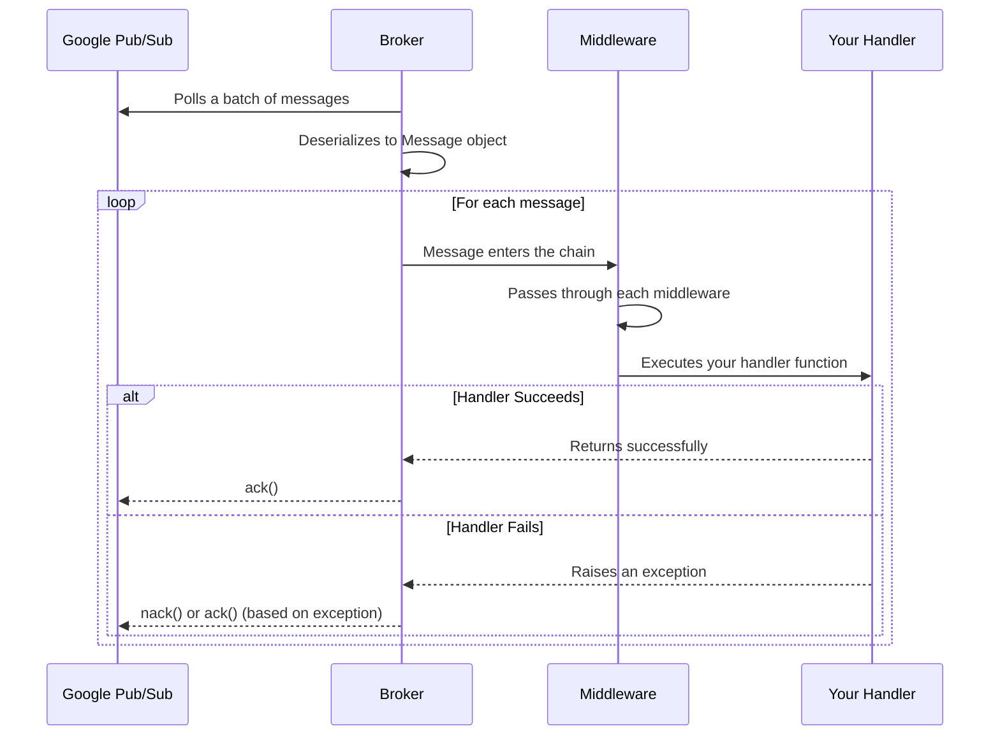

# Message Lifecycle

Every message in FastPubSub follows a well-defined lifecycle from reception to acknowledgment. This process is automatic and safe, with clear points for your logic.

## The Message Journey



### Steps

1. **Polling and Fetching**: The broker's background task continuously polls the subscription, fetching batches of messages
2. **Deserialization**: Each raw message becomes a FastPubSub `Message` object with a clean, Pythonic interface
3. **Middleware Chain**: The message passes through middlewares, which can inspect or modify it
4. **Handler Execution**: Your decorated handler function runs with the message
5. **Acknowledgment**: The outcome determines the message's fate

---

## Acknowledgment Logic

### On Success

If your handler completes without raising an exception, the broker automatically sends an `ack()` to Pub/Sub. The message is permanently removed from the subscription.

```python
@broker.subscriber(
    alias="order-handler",
    topic_name="orders",
    subscription_name="orders-subscription",
)
async def handle_order(message: Message):
    # Process the order
    order = parse_order(message.data)
    await save_to_database(order)
    # If we reach here, message is acked automatically
```

### On Failure

If your handler raises an exception, the broker determines whether to `ack()` or `nack()` based on the exception type.

---

## Error Handling

FastPubSub provides explicit exceptions for controlling message fate.

### `Drop`: Acknowledge and Discard

Use `Drop` when you receive a message that cannot be processed and should not be retried. This could be a "poison pill" with malformed data or an event that's no longer relevant.

```python
from fastpubsub.exceptions import Drop

@broker.subscriber(...)
async def handle_events(message: Message):
    event_attributes = message.attributes
    if event_attributes.get("schema_version") == "v1":
        # We no longer support v1 events
        raise Drop("Schema version v1 is deprecated.")

    # Process v2+ events...
```

**Effect**: The broker sends `ack()`. The message is permanently removed and won't go to the dead-letter topic.

### `Retry`: Negative Acknowledge

Use `Retry` for temporary, recoverable errors (database unavailable, API timeout). The message will be redelivered after a backoff period.

```python
from fastpubsub.exceptions import Retry
import httpx

@broker.subscriber(...)
async def handle_order(message: Message):
    order_id = json.loads(message.data)["order_id"]
    try:
        async with httpx.AsyncClient() as client:
            await client.post(f"https://downstream.service/process/{order_id}")
    except httpx.TimeoutException:
        # Service is slow, retry later
        raise Retry("Downstream service timed out.")
```

**Effect**: The broker sends `nack()`. Pub/Sub holds the message and redelivers after the configured backoff.

!!! tip "Exponential Backoff"

    By default, FastPubSub configures subscriptions with exponential backoff retry, preventing a loop of rapidly failing messages.

### Unhandled Exceptions

Any exception that is not `Drop` or `Retry` is treated as an unexpected error.

**Effect**: The broker catches it, logs the full traceback, and sends `nack()`. The message is redelivered.

```python
@broker.subscriber(...)
async def handle_event(message: Message):
    # If this raises ValueError, KeyError, etc.
    # the message is nacked and redelivered
    data = json.loads(message.data)
    await process(data)
```

---

## Summary Table

| Exception | Action | Message Fate |
|-----------|--------|--------------|
| None (success) | `ack()` | Permanently removed |
| `Drop` | `ack()` | Permanently removed |
| `Retry` | `nack()` | Redelivered after backoff |
| Any other | `nack()` | Redelivered after backoff |

---

## Best Practices

### Validate Early, Drop or Retry Explicitly

```python
from fastpubsub.exceptions import Drop, Retry
from pydantic import ValidationError

@broker.subscriber(...)
async def handle_order(message: Message):
    # Validate message format
    try:
        order = Order.model_validate_json(message.data)
    except ValidationError as e:
        logger.error(f"Invalid order format: {e}")
        raise Drop("Invalid message format")

    # Process the order
    try:
        await process_order(order)
    except ServiceUnavailable:
        raise Retry("Service unavailable")
```

### Use Dead-Letter Topics for Investigation

```python
@broker.subscriber(
    alias="order-processor",
    topic_name="orders",
    subscription_name="orders-subscription",
    dead_letter_topic="orders-dlq",
    max_delivery_attempts=5,
)
async def process_order(message: Message):
    # After 5 failures, message goes to DLQ
    await risky_operation(message.data)
```

### Handle the Dead-Letter Topic

```python
@broker.subscriber(
    alias="dlq-handler",
    topic_name="orders-dlq",
    subscription_name="orders-dlq-subscription",
)
async def handle_failed_orders(message: Message):
    logger.error(f"Message {message.id} failed permanently", extra={
        "message_data": message.data.decode("utf-8"),
        "attributes": message.attributes,
    })
    await send_alert_to_ops_team(message)
    await store_for_manual_review(message)
```

---

## Future Development

The framework is actively developed with planned features:

- **FastAPI-Style Exception Handlers**: Register global handlers for specific exceptions
- **Configurable Acknowledge Policies**: Policies like "ack on receive" for fire-and-forget tasks
- **Serialization Error Policies**: Control what happens when messages can't be deserialized

---

## Recap

- **Lifecycle is a pipeline**: Poll → Deserialize → Middleware → Handler → Ack/Nack
- **Success means ack**: A handler that completes without error results in acknowledgment
- **You control errors**:
    - `raise Drop()` to permanently discard a message (ack)
    - `raise Retry()` to request redelivery (nack)
    - Any other exception results in a nack to ensure the message isn't lost
- **Dead-letter topics**: Catch messages that fail repeatedly for investigation
