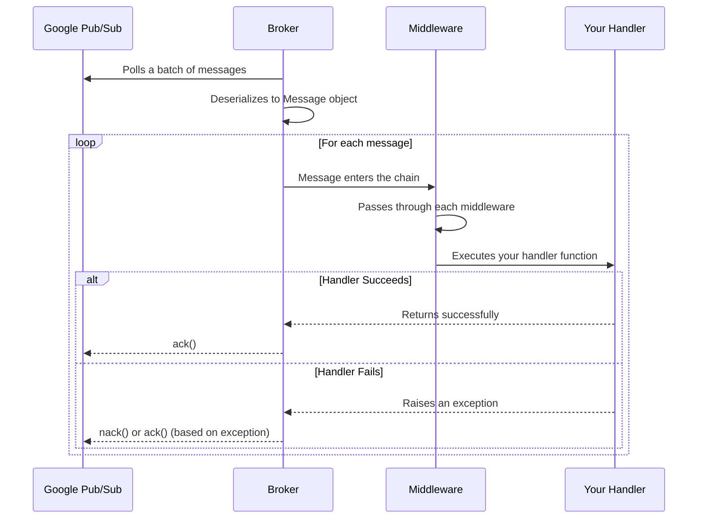

# Message Lifecycle

Every message in FastPubSub follows a well-defined lifecycle from reception to acknowledgment. This process is automatic and safe, with clear points for your logic.

## The Message Journey



### Steps

1. **Polling and Fetching**: The broker's background task continuously polls the subscription, fetching batches of messages
2. **Deserialization**: Each raw message becomes a FastPubSub `Message` object with a clean dataclass interface
3. **Middleware Chain**: The message passes through middlewares, which can inspect, intercept or clone its data.
4. **Handler Execution**: Your decorated handler function runs with the message
5. **Acknowledgment**: The outcome determines the message's fate. If your handler completes without raising an exception, the broker automatically sends an `ack()` to Pub/Sub. The message is permanently removed from the subscription.

---

## Error Handling

Error handling is a critical part of any message-based system. FastPubSub provides a powerful and explicit model for managing both expected and unexpected failures.

### Controlled Acknowledgement with `Drop`

Sometimes, you receive a message that you cannot process, but you don't want it to be retried. This could be a "poison pill" message with malformed data or an event that is no longer relevant. For these cases, FastPubSub provides the `Drop` exception.

* **What it does:** Raising Drop tells the broker to `ack()` the message. This permanently removes it from the queue, preventing it from being redelivered or sent to a Dead-Letter Topic (DLT).
* **When to use it:** Use this when a message is valid from Pub/Sub's perspective but invalid for your business logic, and you know it will never be processable.


```python
from fastpubsub.exceptions import Drop

@broker.subscriber(...)
async def handle_events(message: Message):
    event_attributes = message.attributes
    if event_attributes.get("schema_version") == "v1":
        # We no longer support v1 events
        raise Drop("Schema version v1 is deprecated.")

    # Process v2+ events...
```


### Controlled Retries with `Retry`

For temporary, recoverable errors (e.g., a database is temporarily unavailable, a downstream API times out), you want Pub/Sub to redeliver the message later. The `Retry` exception makes this intent clear. 

* **What it does:** Raising `Retry` tells the broker to `nack()` the message. Google Pub/Sub will hold the message and attempt to redeliver it after a period of time.
* **When to use it:** Use this for any transient error where you expect a future attempt to succeed.


```python
from fastpubsub.exceptions import Retry
import httpx

@broker.subscriber(...)
async def handle_order(message: Message):
    order_id = json.loads(message.data)["order_id"]
    try:
        async with httpx.AsyncClient() as client:
            await client.post(f"https://downstream.service/process/{order_id}")
    except httpx.TimeoutException:
        # Service is slow, retry later
        raise Retry("Downstream service timed out.")
```

!!! tip "Exponential Backoff"

    By default, FastPubSub configures subscriptions with exponential backoff retry, preventing a loop of rapidly failing messages. Read the full feature documention on [Google Pub/Sub](https://cloud.google.com/pubsub/docs/subscription-retry-policy).

### The Safety Net: Unhandled Exceptions

Any exception that is not `Drop` or `Retry` is considered an unhandled unexpected error. FastPubSub default behavior acts as a safety net.

* **What it does:** If your handler raises any other exception (e.g., `ValueError`, `KeyError`, `DatabaseError`), the broker will automatically catch it, log the full traceback, and `nack()` the message.
* **When it happens:** This covers all unexpected bugs and failures in your code, ensuring that no message is accidentally lost due to an unforeseen error.


```python
@broker.subscriber(...)
async def handle_event(message: Message):
    # If this raises ValueError, KeyError, etc.
    # the message is nacked and redelivered
    data = json.loads(message.data)
    await process(data)
```

---

## Summary Table

| Exception | Action | Message Fate |
|-----------|--------|--------------|
| None (success) | `ack()` | Permanently removed |
| `Drop` | `ack()` | Permanently removed |
| `Retry` | `nack()` | Redelivered after backoff |
| Any other | `nack()` | Redelivered after backoff |

---

## Future Development

The framework is actively developed with planned features:

- **FastAPI-Style Exception Handlers**: Register global handlers for specific exceptions
- **Configurable Acknowledge Policies**: Policies like "ack on receive" for fire-and-forget tasks
- **Serialization Error Policies**: Control what happens when messages can't be deserialized

---

## Recap

- **Lifecycle is a pipeline**: Poll → Deserialize → Middleware → Handler → Ack/Nack
- **Success means ack**: A handler that completes without error results in acknowledgment
- **You control errors**:
    - `raise Drop()` to permanently discard a message (ack)
    - `raise Retry()` to request redelivery (nack)
    - Any other exception results in a nack to ensure the message isn't lost
- **Dead-letter topics**: Catch messages that fail repeatedly for investigation
